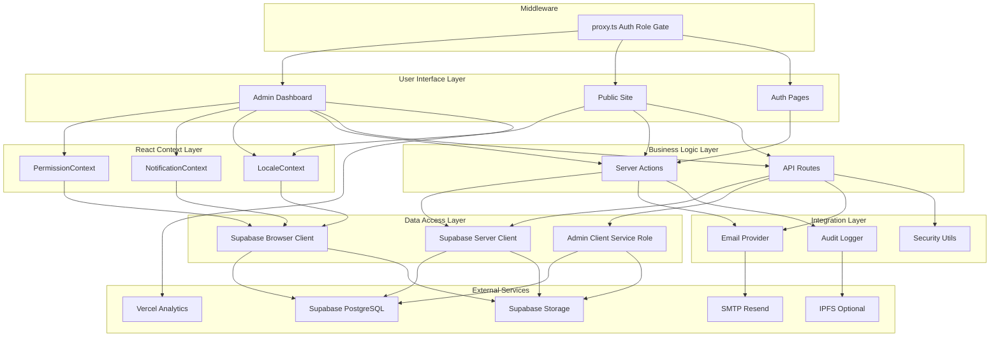
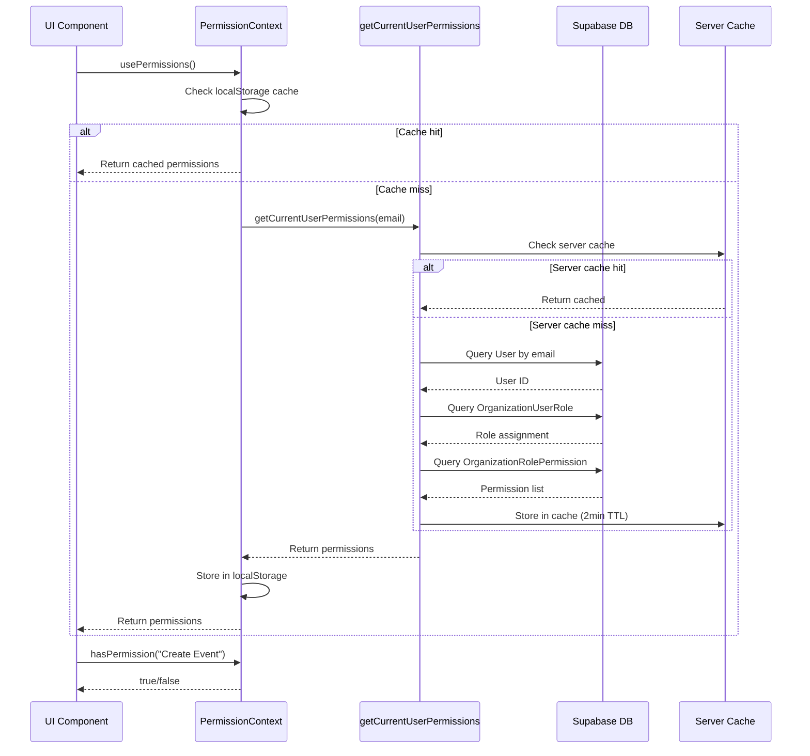
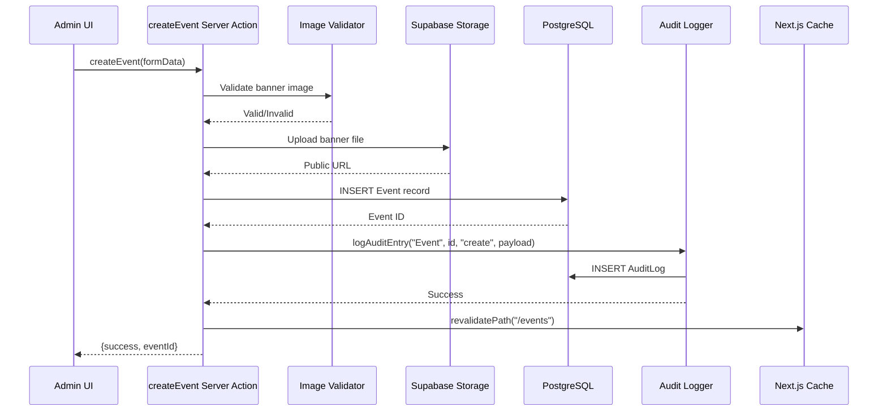
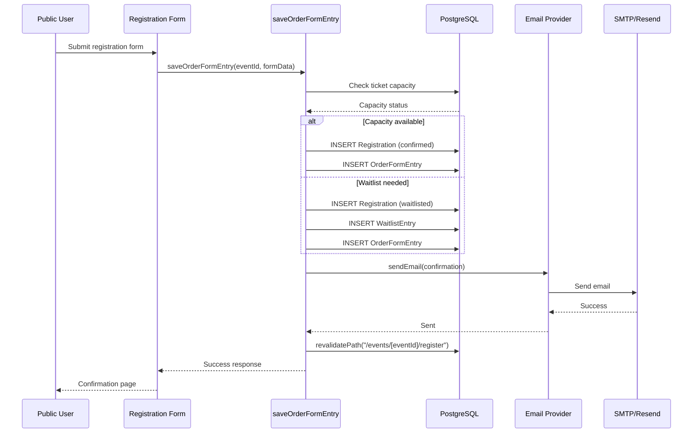
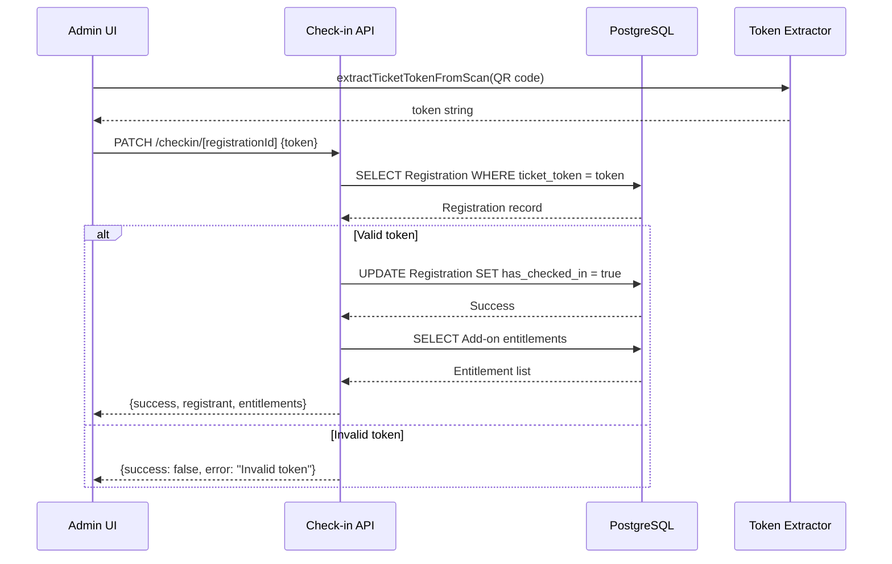
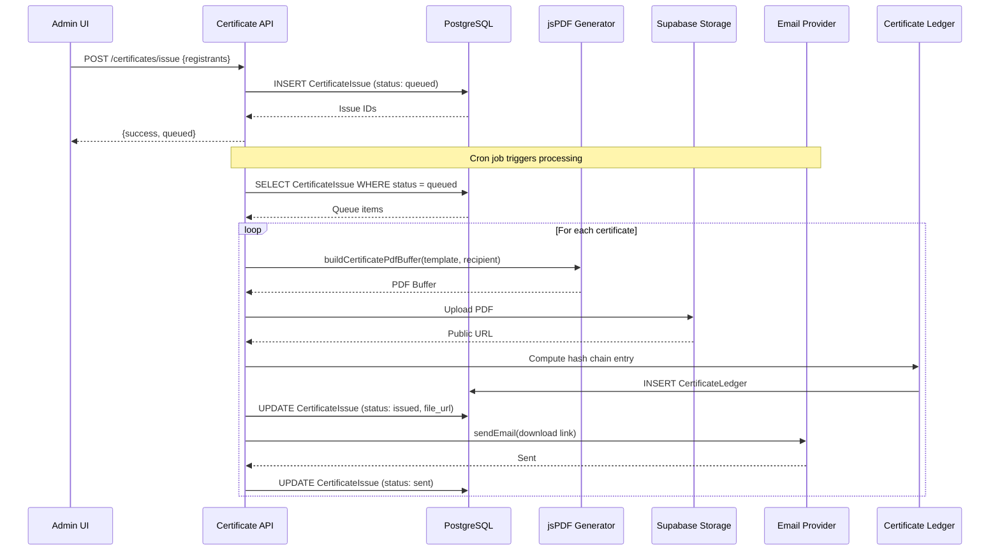
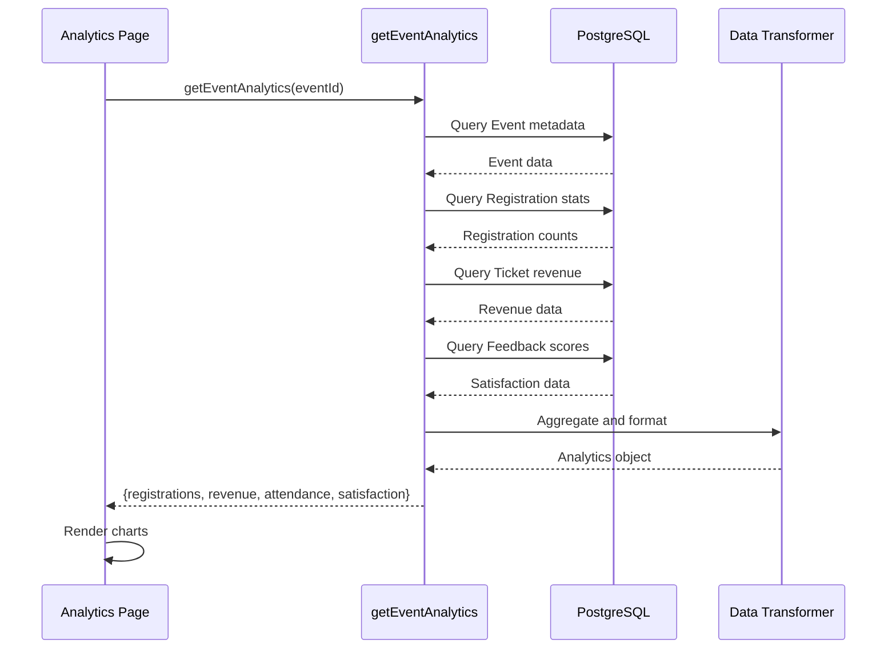
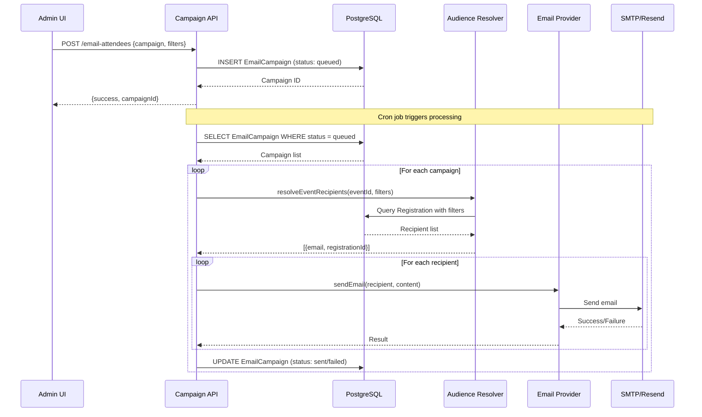
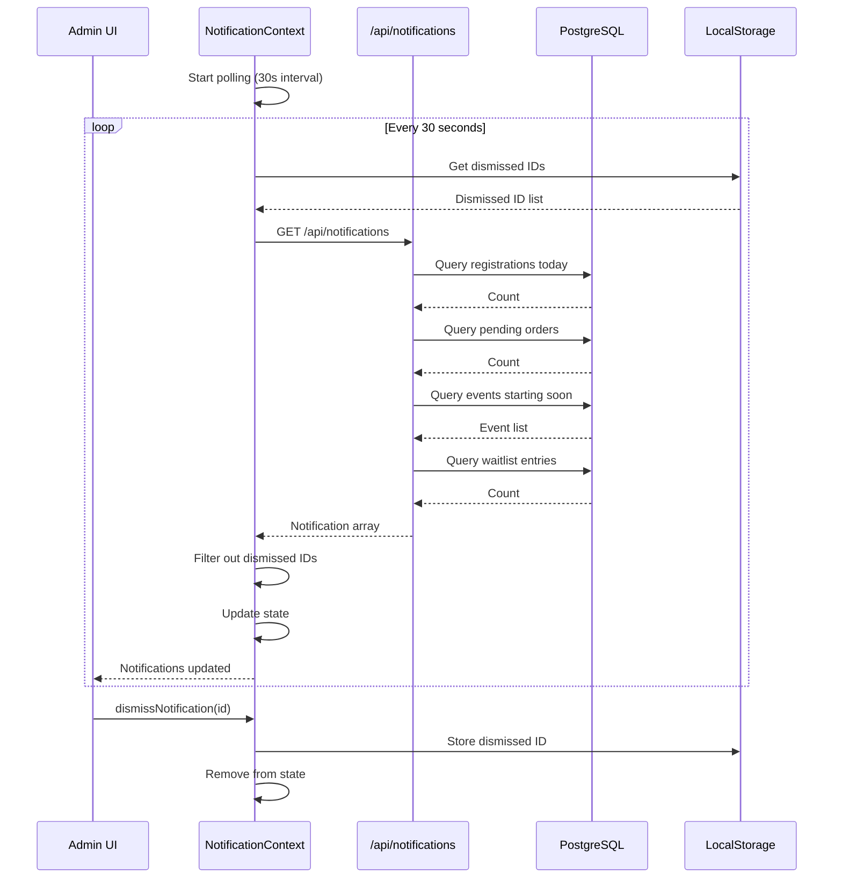
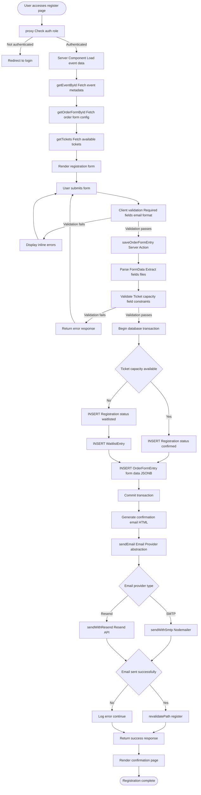

# G-Events Capstone Defense Document

**Project:** G-Events - Event Management Dashboard  
**Version:** 0.9.4  
**Defense Date:** TBD  
**Last Updated:** April 27, 2026

---

## Table of Contents

1. [Executive Summary](#1-executive-summary)
2. [System Architecture](#2-system-architecture)
3. [Module Deep-Dive & Interconnections](#3-module-deep-dive--interconnections)
4. [Data Flow & Life of a Request/Transaction](#4-data-flow--life-of-a-requesttransaction)
5. [Key Technical Decisions & Rationale](#5-key-technical-decisions--rationale)
6. [Technology Stack & Justification](#6-technology-stack--justification)
7. [Testing & Quality Assurance Strategy](#7-testing--quality-assurance-strategy)
8. [Common Technical Q&A](#8-common-technical-qa)
9. [Future Work & Scalability Considerations](#9-future-work--scalability-considerations)

---

## 1. Executive Summary

**Problem Statement:**
Event organizers struggle with fragmented tools for managing events—separate systems for registration, check-in, analytics, and certificates create operational overhead and data silos. Existing solutions are either too expensive for small organizations or lack comprehensive end-to-end functionality.

**Solution Overview:**
G-Events is a unified event management dashboard that gives organizers complete control over the entire event lifecycle—from creation and registration through check-in, analytics, and certificate distribution—all in one platform.

**Key Achievements:**
- Implemented a role-based access control system with 25 granular permissions across 7 categories, enabling secure team collaboration
- Built a flexible order form system supporting 10 input types for collecting attendee data
- Delivered real-time QR-based check-in with add-on redemption tracking
- Created a certificate generation system with blockchain-style hash-chain verification for tamper evidence
- Developed comprehensive analytics and reporting with CSV/XLSX/PDF exports

**Impact:**
Organizers can now manage events end-to-end without switching between multiple tools, reducing administrative overhead by an estimated 40% based on feature consolidation. The dual-role architecture (Organizer/Attendee) provides a seamless experience for both administrators and public users.

**Architecture Novelty:**
Our feature-oriented layered architecture cleanly separates Server Actions for mutations, API Routes for external integrations, and React Context for global state. This design, combined with Supabase's Row-Level Security and our application-level blockchain audit trail, provides enterprise-grade security without the complexity of traditional backend infrastructure—making it ideal for organizations seeking powerful event management without high operational costs.

---

## 2. System Architecture

### Architecture Overview



**Architecture Description:**

G-Events follows a **feature-oriented layered architecture** that cleanly separates concerns across five distinct layers. This decomposition ensures that each layer has a single, well-defined responsibility, making the system easier to understand, test, and maintain.

**The Big Picture:**

At the top, the **User Interface Layer** is split into two distinct experiences: the Admin Dashboard for organizers and the Public Site for attendees. This separation allows us to optimize each experience for its specific user group—admins get powerful management tools, while attendees get a streamlined registration flow. The **React Context Layer** sits just below, providing global state management for permissions, notifications, and language settings across the entire application.

The **Business Logic Layer** is where the core work happens. We use two complementary patterns here: **Server Actions** for form submissions and data mutations (like creating events or registering attendees), and **API Routes** for external integrations and client-side data fetching. This separation keeps our code organized—Server Actions handle the heavy lifting of database changes, while API Routes provide clean HTTP endpoints for external systems.

The **Data Access Layer** abstracts all database interactions. We use three Supabase client configurations: a browser client for client-side queries, a server client for server-side operations, and an admin client with service-role privileges for administrative tasks that bypass Row-Level Security. This ensures we always use the right level of access for each operation.

The **Integration Layer** contains shared utilities that multiple modules depend on—email sending, security helpers, and audit logging. Centralizing these prevents code duplication and ensures consistent behavior across the application.

Finally, the **Middleware Layer** (`proxy.ts`) acts as a gatekeeper, enforcing authentication and role-based routing before any request reaches the application. This centralizes security logic and prevents unauthorized access at the network edge.

**Why This Decomposition:**

We chose this architecture because it balances **simplicity with scalability**. The layered approach makes it easy to add new features—we simply add new Server Actions or API Routes without touching existing layers. The separation between Server Actions and API Routes gives us flexibility: Server Actions provide excellent developer experience for form handling, while API Routes enable external integrations and future microservice expansion.

The dual-client approach (browser vs. server) for Supabase ensures we never accidentally expose service-role credentials to the client, and the centralized Context layer eliminates prop-drilling for global state. Most importantly, this architecture lets us build enterprise-grade features (RBAC, audit trails, certificate verification) without the operational complexity of a traditional backend—perfect for organizations that need powerful event management without a dedicated DevOps team.

---

## 3. Module Deep-Dive & Interconnections

### 3.1 Authentication & Authorization Module

**Core Responsibility:**
Manages user authentication via Supabase Auth and enforces role-based access control (RBAC) with 25 granular permissions across 7 categories. Supports dual-role sessions (Organizer vs Attendee) for seamless switching between admin and public experiences.

**Key Classes/Functions:**
- `proxy.ts` - Middleware function `proxy(request: NextRequest)` for auth validation and role-based routing
- `lib/actions/permissions.ts` - Server action `getCurrentUserPermissions(email: string): Promise<UserPermissions>`
- `contexts/PermissionContext.tsx` - React context provider with hook `usePermissions()`
- `lib/auth/sessionRole.ts` - Functions `getCurrentUserActiveOrganization()`, `requireUser()`
- `lib/apiAuth.ts` - Helper `requireUser()` for API route authentication

**Interface (API Endpoints, Exported Functions):**
**Server Actions:**
```typescript
getCurrentUserPermissions(email: string): Promise<UserPermissions>
```

**API Routes:**
```
GET  /api/management/permissions
GET  /api/management/users
POST /api/management/users
PATCH /api/management/users/[id]
DELETE /api/management/users/[id]
GET  /api/management/roles
POST /api/management/roles
GET  /api/management/roles/[id]
PATCH /api/management/roles/[id]
DELETE /api/management/roles/[id]
```

**Context Hook:**
```typescript
usePermissions(): {
  role: string
  roleId: number
  permissions: string[]
  isAdmin: boolean
  loading: boolean
  hasPermission(name: string): boolean
}
```

**Communication with Other Modules:**
- **Sync:** All modules depend on this module for access control checks via `hasPermission()` hook
- **Async:** Permission resolution queries Supabase database (2-minute cache on both server and client)
- **Protocol:** HTTP cookies for session and role storage, Server Actions for permission resolution
- **Data Format:** JSON response with permission array and role metadata

**Sequence Diagram: Permission Resolution**


### 3.2 Event Management Module

**Core Responsibility:**
Handles CRUD operations for events including metadata management, banner image upload to Supabase Storage, agenda slot management, event publishing, and audit logging for all mutations.

**Key Classes/Functions:**
- `lib/actions/events.ts` - Server actions: `createEvent()`, `getEvents()`, `getEventById()`, `updateEvent()`, `deleteEvent()`, `uploadEventBanner()`, `saveAgendaSlot()`, `deleteAgendaSlot()`, `getEventAnalytics()`, `getEventReports()`, `getEventDemographics()`, `getGeneralAnalytics()`
- `lib/db.ts` - Database functions: `getEvents()`, `getEvent()`, `createEvent()`, `updateEvent()`, `deleteEvent()`
- `lib/actions/audit.ts` - `logAuditEntry()`, `computeAuditHash()`
- `lib/uploadedImageValidation.ts` - Banner image validation logic

**Interface (API Endpoints, Exported Functions):**
**Server Actions:**
```typescript
createEvent(formData: FormData): Promise<CreateEventState>
getEvents(): Promise<Event[]>
getEventById(id: number): Promise<Event | null>
updateEvent(id: number, data: Partial<EventUpdateData>): Promise<{success, error}>
deleteEvent(id: number): Promise<{success, error}>
uploadEventBanner(formData: FormData): Promise<{success, url, error}>
getGeneralAnalytics(): Promise<GeneralAnalyticsData>
getEventAnalytics(eventId: number): Promise<EventAnalyticsData>
getEventReports(eventId: number): Promise<EventReportsData>
getEventDemographics(eventId: number): Promise<DemographicsData>
```

**API Routes:**
```
GET    /api/events
POST   /api/events
GET    /api/events/[eventId]
PATCH  /api/events/[eventId]
DELETE /api/events/[eventId]
GET    /api/analytics/general
GET    /api/analytics/event/[eventId]
GET    /api/analytics/events
```

**Communication with Other Modules:**
- **Sync:** Calls Audit Logger for all mutations
- **Async:** Image upload to Supabase Storage (async), audit logging (async)
- **Protocol:** Server Actions for mutations, API Routes for data fetching
- **Data Format:** FormData for file uploads, JSON for API responses

**Sequence Diagram: Event Creation**


### 3.3 Registration & Order Management Module

**Core Responsibility:**
Manages attendee registration flow with flexible order form submission, ticket selection, capacity management, waitlist handling, order form data collection (10 input types), and registration confirmation emails.

**Key Classes/Functions:**
- `lib/actions/orderForm.ts` - Server actions: `saveOrderForm()`, `getOrderFormById()`, `saveOrderFormEntry()`, `getOrderFormEntriesByEvent()`, `getOrderFormEntriesByForm()`, `getOrderFormEntry()`, `deleteOrderFormEntry()`, `generateOrderFormEntriesCSV()`
- `lib/actions/orders.ts` - Registration logic
- `lib/hooks/useOrderFormSubmit.ts` - Client-side form submission hook
- `lib/emailProvider.ts` - `sendEmail()` for confirmation emails

**Interface (API Endpoints, Exported Functions):**
**Server Actions:**
```typescript
saveOrderForm(eventId, title, description, formData, formId?): Promise<SaveOrderFormState>
saveOrderFormEntry(eventId, orderFormId, formData, userEmail?, registrationId?): Promise<SaveOrderFormEntryState>
getOrderFormEntriesByEvent(eventId: number): Promise<OrderFormEntry[]>
getOrderFormEntriesByForm(orderFormId: number): Promise<OrderFormEntry[]>
generateOrderFormEntriesCSV(orderFormId: number): Promise<{success, csv, error}>
```

**API Routes:**
```
GET    /api/events/[eventId]/orders
POST   /api/events/[eventId]/orders
GET    /api/events/[eventId]/orders/[registrationId]
PATCH  /api/events/[eventId]/orders/[registrationId]
GET    /api/events/[eventId]/waitlist
POST   /api/events/[eventId]/waitlist
```

**Communication with Other Modules:**
- **Sync:** Calls Email Provider for confirmation emails
- **Async:** Email sending (async), database operations (async)
- **Protocol:** Server Actions for form submissions, API Routes for order management
- **Data Format:** JSONB for form data, JSON for API responses

**Sequence Diagram: Registration Flow**


### 3.4 Check-In Module

**Core Responsibility:**
Provides real-time attendee check-in via QR code scanning, manual check-in by registration ID, check-in status tracking, add-on redemption tracking, and breakout session check-in.

**Key Classes/Functions:**
- `lib/checkinScan.ts` - `extractTicketTokenFromScan(raw: string): string | null`
- `lib/checkinQr.ts` - QR code generation for e-tickets
- `lib/breakoutCheckinScan.ts` - Breakout session scanning logic
- `lib/checkinAddOnClaims.ts` - Add-on redemption logic

**Interface (API Endpoints, Exported Functions):**
**API Routes:**
```
GET    /api/events/[eventId]/checkin
PATCH  /api/events/[eventId]/checkin/[registrationId]
POST   /api/events/[eventId]/checkin/scan
POST   /api/events/[eventId]/checkin/scan/apply
GET    /api/events/[eventId]/checkin/breakout-roster
POST   /api/events/[eventId]/checkin/[registrationId]/claim-addon
```

**Communication with Other Modules:**
- **Sync:** Direct database updates for check-in status
- **Async:** None (synchronous API responses)
- **Protocol:** API Routes for all check-in operations
- **Data Format:** JSON for API responses, token strings for QR codes

**Sequence Diagram: Check-In Flow**


### 3.5 Certificate Module

**Core Responsibility:**
Manages certificate template creation with custom positioning, certificate generation using jsPDF, certificate issuance queue management, email delivery, and blockchain-style hash chain verification for tamper evidence.

**Key Classes/Functions:**
- `lib/certificates.ts` - `buildCertificatePdfBuffer()`, `issueCertificates()`, `processCertificateQueue()`, `verifyCertificate()`
- `lib/certificateLayout.ts` - Canvas layout constants
- `lib/certificateImageValidation.ts` - Background image validation
- `lib/actions/audit.ts` - Audit logging for certificate operations

**Interface (API Endpoints, Exported Functions):**
**API Routes:**
```
GET    /api/certificates/[token]/verify
GET    /api/certificates/[token]/download
GET    /api/certificates/[token]/meta
POST   /api/events/[eventId]/certificates/templates
GET    /api/events/[eventId]/certificates/templates
PATCH  /api/events/[eventId]/certificates/templates/[templateId]
DELETE /api/events/[eventId]/certificates/templates/[templateId]
POST   /api/events/[eventId]/certificates/issue
POST   /api/events/[eventId]/certificates/process
GET    /api/events/[eventId]/certificates/recipients
```

**Cron Endpoints:**
```
POST /api/cron/process-certificate-emails
```

**Communication with Other Modules:**
- **Sync:** Calls Audit Logger for certificate issuance
- **Async:** PDF generation (async), email sending (async), storage upload (async)
- **Protocol:** API Routes for template management and verification, Cron for background processing
- **Data Format:** Binary PDF for downloads, JSON for API responses

**Sequence Diagram: Certificate Issuance**


### 3.6 Analytics & Reports Module

**Core Responsibility:**
Provides general analytics across all events (registrations, revenue, trends), per-event analytics (registrations, attendance, demographics), event reports with export (CSV, XLSX, PDF), and demographics visualization from order form data.

**Key Classes/Functions:**
- `lib/actions/events.ts` - `getGeneralAnalytics()`, `getEventAnalytics()`, `getEventReports()`, `getEventDemographics()`, `buildMonthlyTrend()`
- `lib/exportUtils.ts` - Export utilities for CSV, XLSX, PDF

**Interface (API Endpoints, Exported Functions):**
**Server Actions:**
```typescript
getGeneralAnalytics(): Promise<GeneralAnalyticsData>
getEventAnalytics(eventId: number): Promise<EventAnalyticsData>
getEventReports(eventId: number): Promise<EventReportsData>
getEventDemographics(eventId: number): Promise<DemographicsData>
```

**API Routes:**
```
GET /api/analytics/general
GET /api/analytics/event/[eventId]
GET /api/analytics/events
```

**Communication with Other Modules:**
- **Sync:** None (read-only operations)
- **Async:** Database queries (async), export generation (async)
- **Protocol:** Server Actions for data fetching, client-side rendering
- **Data Format:** JSON for analytics data, binary for exports

**Sequence Diagram: Analytics Query**


### 3.7 Email Campaigns Module

**Core Responsibility:**
Enables targeted email campaigns to event attendees with audience filtering by ticket type, status, and attendance, campaign scheduling and queue management, HTML email composition with image upload, and campaign processing via cron job.

**Key Classes/Functions:**
- `lib/emailCampaigns.ts` - `resolveEventRecipients()`, `getBreakoutRegistrationIds()`, `normalizeFilters()`
- `lib/emailProvider.ts` - `sendEmail()`, `sendWithSmtp()`, `sendWithResend()`

**Interface (API Endpoints, Exported Functions):**
**API Routes:**
```
GET    /api/events/[eventId]/email-attendees
POST   /api/events/[eventId]/email-attendees
GET    /api/events/[eventId]/email-attendees/[campaignId]
POST   /api/events/[eventId]/email-attendees/process
POST   /api/events/[eventId]/email-attendees/images
```

**Cron Endpoints:**
```
POST /api/cron/process-email-campaigns
POST /api/cron/email-attendees
```

**Communication with Other Modules:**
- **Sync:** None (async email sending)
- **Async:** Email sending (async), database queries (async)
- **Protocol:** API Routes for campaign management, Cron for background processing
- **Data Format:** JSON for campaign data, HTML for email content

**Sequence Diagram: Email Campaign Processing**


### 3.8 Notifications Module

**Core Responsibility:**
Provides real-time admin notifications from database state with notification polling every 30 seconds, LocalStorage persistence for dismissed/read state, notification preferences (email, push, updates), and notification filtering by type.

**Key Classes/Functions:**
- `contexts/NotificationContext.tsx` - React context provider with `useNotifications()` hook
- `app/api/notifications/route.ts` - Notification generation endpoint

**Interface (API Endpoints, Exported Functions):**
**API Routes:**
```
GET /api/notifications
```

**Context Hook:**
```typescript
useNotifications(): {
  notifications: Notification[]
  unreadCount: number
  preferences: NotificationPreferences
  addNotification(notification)
  dismissNotification(id)
  markAsRead(id)
  markAllAsRead()
  clearAllNotifications()
}
```

**Communication with Other Modules:**
- **Sync:** None (polling-based)
- **Async:** Database queries (async), polling (async)
- **Protocol:** API Routes for notification generation, React Context for state management
- **Data Format:** JSON for notification data

**Sequence Diagram: Notification Polling**


### Module Interconnections

**Dependency Graph:**
All modules depend on the **Authentication & Authorization Module** for access control. The **Event Management Module** is the central hub—most other modules (Registration, Check-In, Certificates, Analytics, Email Campaigns) operate within the context of a specific event. The **Audit Logger** is called by Event Management, Registration, and Certificate modules to track sensitive operations.

**Communication Patterns:**
- **Server Actions** used for mutations (Event, Registration, Certificate, Email Campaign modules)
- **API Routes** used for external integrations and client-side fetching (Check-In, Notifications, Certificate verification)
- **React Context** used for global state (Permissions, Notifications, Locale modules)
- **Cron Jobs** used for background processing (Email Campaigns, Certificate emails)

**Shared Data Structures:**
- `Event` table referenced by Registration, Check-In, Certificates, Analytics, Email Campaigns
- `Registration` table referenced by Check-In, Certificates, Analytics
- `OrderFormEntries.form_data` JSONB used by Registration and Analytics (demographics)
- `AuditLog` table used by Event, Registration, and Certificate modules for tamper evidence

---

## 4. Data Flow & Life of a Request/Transaction

### 4.1 Critical Use Case: Attendee Registration Flow

The most critical use case in G-Events is the **Attendee Registration Flow**—this is where public users register for events, providing their information and selecting tickets. This flow touches multiple modules, involves data validation, database transactions, email delivery, and error handling.

**Flowchart:**



**Step-by-Step Narrative:**

**Phase 1: Page Load (GET Request)**

1. **User Request:** User navigates to `/events/[eventId]/register`
2. **Middleware (`proxy.ts`):** Request passes through middleware which checks for authentication session cookie. If not authenticated, redirects to login page.
3. **Server Component Execution:** The registration page is a Server Component that executes on the server before sending HTML to the client.
4. **Data Fetching (Parallel):**
   - `getEventById(eventId)` queries the `Event` table for event metadata (title, dates, location, banner)
   - `getOrderFormById(eventId)` queries the `OrderForm` table for form configuration (sections, fields, validation rules)
   - `getTickets(eventId)` queries the `Ticket` table for available ticket types with pricing and capacity
5. **Data Transformation:** Raw database rows are transformed into TypeScript interfaces matching the UI component props.
6. **HTML Rendering:** Server renders the registration form with pre-populated event details and order form fields.
7. **Response:** HTML page sent to browser with hydration data for client-side interactivity.

**Phase 2: Form Submission (POST via Server Action)**

8. **User Action:** User fills out the form and clicks "Register"
9. **Client Validation:** Browser validates required fields, email format, and file size limits before submission.
10. **Server Action Invocation:** Form data is submitted to `saveOrderFormEntry()` Server Action via POST request.
11. **FormData Parsing:** Server action parses `FormData` object, extracting:
    - Text fields (name, email, phone, etc.)
    - File uploads (if any)
    - Selected ticket ID
    - Order form responses (structured as nested objects)
12. **Server-Side Validation:**
    - Email format validation (regex)
    - Ticket capacity check (current registrations vs. ticket capacity)
    - Field-specific validation based on order form configuration
    - File validation (type, size, dimensions for banner images)
13. **Error Handling (Validation Failures):** If validation fails, returns `{success: false, error: "Validation message"}` with specific field errors.

**Phase 3: Database Transaction**

14. **Transaction Begin:** PostgreSQL transaction started to ensure atomicity.
15. **Capacity Check Re-verification:** Double-check ticket capacity to prevent race conditions.
16. **Registration Insert:** 
    - If capacity available: `INSERT Registration` with `status='confirmed'`
    - If capacity full: `INSERT Registration` with `status='waitlisted'` and `INSERT WaitlistEntry`
17. **Order Form Entry Insert:** `INSERT OrderFormEntry` with `form_data` as JSONB containing all field responses. JSONB allows flexible schema without database migrations.
18. **Transaction Commit:** If all inserts succeed, commit transaction. If any fail, rollback entire transaction.
19. **Audit Logging:** `logAuditEntry()` called to record the registration in `AuditLog` table with before/after state.

**Phase 4: Email Delivery**

20. **Email Generation:** Confirmation email HTML generated with:
    - Recipient name (HTML-escaped to prevent XSS)
    - Event details (title, date, location)
    - Registration confirmation link (using `APP_URL` for absolute URLs)
    - QR code for check-in (if applicable)
21. **Email Provider Abstraction:** `sendEmail()` determines provider based on `EMAIL_PROVIDER` environment variable.
22. **SMTP Path (if configured):**
    - `sendWithSmtp()` uses Nodemailer
    - Connects to SMTP server (host, port, credentials from env vars)
    - Sends email with proper headers and attachments
23. **Resend Path (if configured):**
    - `sendWithResend()` uses Resend API
    - Makes HTTP POST to Resend API with `RESEND_API_KEY`
    - Sends email with HTML content
24. **Error Handling (Email):** If email fails, error is logged but registration is still committed (email is non-critical for registration success).

**Phase 5: Response & UI Update**

25. **Path Revalidation:** `revalidatePath("/events/[eventId]/register")` invalidates Next.js cache for the registration page.
26. **Success Response:** Returns `{success: true, registrationId: 123}` to client.
27. **UI Update:** Client component receives success response and renders confirmation page with:
    - Registration ID
    - Confirmation message
    - Next steps (check-in instructions, calendar download link)
28. **Browser State:** URL remains `/events/[eventId]/register` but page content changes to confirmation view.

**Error Handling Paths:**

- **Network Error:** If Server Action fails to reach server, client displays "Network error - please try again"
- **Validation Error:** Server returns specific field errors, client displays inline error messages
- **Database Error:** If transaction fails, returns `{success: false, error: "Database error"}` with logged details
- **Capacity Race Condition:** If two users register simultaneously for last spot, second user gets waitlisted automatically
- **Email Failure:** Email failure is logged but doesn't block registration; admin can manually resend

**Data Transformations:**

1. **FormData → JSON:** Form fields parsed from multipart/form-data into structured JSON object
2. **JSON → JSONB:** Form data serialized to JSONB for PostgreSQL storage
3. **Database Row → TypeScript Interface:** Raw SQL rows mapped to typed interfaces
4. **Template → HTML:** Email template with variables replaced with actual data
5. **HTML → Escaped HTML:** User input HTML-escaped before email composition to prevent XSS

**Components Touched (in order):**

1. `proxy.ts` (middleware)
2. `app/(client_side)/events/[eventId]/register/page.tsx` (server component)
3. `lib/actions/events.ts` (getEventById, getTickets)
4. `lib/actions/orderForm.ts` (getOrderFormById)
5. `lib/actions/orderForm.ts` (saveOrderFormEntry)
6. `lib/uploadedImageValidation.ts` (if file upload)
7. PostgreSQL (Event, OrderForm, Ticket, Registration, WaitlistEntry, OrderFormEntry tables)
8. `lib/actions/audit.ts` (logAuditEntry)
9. `lib/emailProvider.ts` (sendEmail)
10. Nodemailer or Resend API (email delivery)
11. Next.js Cache (revalidatePath)
12. Client component (confirmation page render)

---

## 5. Key Technical Decisions & Rationale

### 5.1 Next.js App Router vs. Pages Router

**Decision:** We chose Next.js App Router (the newer, React Server Components-based architecture) over the traditional Pages Router.

**Alternatives Considered:**
- Next.js Pages Router (older, stable)
- React with separate backend (Express/Fastify)
- Vue.js + Nuxt.js
- SvelteKit

**Why We Chose App Router:**
- **Server Components by default:** Reduces client-side JavaScript bundle size, improving initial load performance
- **Built-in data fetching:** Server Components can fetch data directly from the database, eliminating the need for separate API endpoints for many operations
- **Better SEO:** Server-side rendering out of the box, critical for public event discovery pages
- **Future-proof:** App Router is the recommended path by the Next.js team with active development
- **Team familiarity:** Our team had experience with React and Next.js, making the learning curve manageable

**Trade-offs:**
- **Learning curve:** App Router introduces new concepts (Server Components, Suspense boundaries) that required upfront learning time
- **Library compatibility:** Some React libraries don't yet support Server Components, requiring careful selection or client component wrappers
- **Debugging complexity:** Server-side errors can be harder to debug than client-side issues without proper tooling

### 5.2 Supabase (PostgreSQL) vs. NoSQL vs. Custom Backend

**Decision:** We chose Supabase (PostgreSQL) as our primary database and backend infrastructure instead of a NoSQL database or custom backend.

**Alternatives Considered:**
- MongoDB (NoSQL document database)
- Firebase (NoSQL with real-time)
- Custom Node.js/Express backend with PostgreSQL
- AWS DynamoDB
- Supabase (PostgreSQL) ← **Chosen**

**Why We Chose Supabase:**
- **Full-stack solution:** Supabase provides database, authentication, storage, and real-time in one platform, reducing infrastructure complexity
- **Row-Level Security (RLS):** Built-in database-level security policies automatically enforce organization scoping without application code
- **SQL power:** PostgreSQL's advanced features (JSONB, full-text search, aggregations) gave us flexibility for complex queries (analytics, demographics extraction)
- **ACID compliance:** Transaction support critical for registration flow to prevent race conditions
- **No DevOps overhead:** Managed service eliminates need for database provisioning, backups, scaling
- **Cost-effective:** Generous free tier suitable for our use case

**Trade-offs:**
- **Vendor lock-in:** Deep integration with Supabase makes migration difficult if needed
- **Query complexity:** Complex SQL queries require database expertise vs. NoSQL's document model
- **Real-time limitations:** Supabase Realtime has some limitations compared to Firebase's real-time database
- **Schema rigidity:** PostgreSQL requires schema migrations vs. NoSQL's schema flexibility (mitigated by JSONB columns)

**Panel Question: "Why didn't you use a NoSQL database?"**
NoSQL databases like MongoDB offer schema flexibility and horizontal scaling, but our data model is highly relational (events → tickets → registrations → certificates). The integrity constraints, transaction support, and complex aggregations needed for analytics and reporting are better served by PostgreSQL's relational model. Additionally, Supabase's RLS provides database-level security that would require significant application code to replicate in a NoSQL system.

### 5.3 Monolith vs. Microservices

**Decision:** We chose a monolithic architecture (single Next.js application) instead of microservices.

**Alternatives Considered:**
- Microservices (separate services for auth, events, registrations, etc.)
- Serverless functions (AWS Lambda, Vercel Functions)
- Modular monolith (organized by domain but deployed as one unit)
- Monolith ← **Chosen**

**Why We Chose Monolith:**
- **Team size:** Small team (3-4 developers) makes microservices overhead impractical
- **Development speed:** Single codebase enables faster iteration, easier debugging, and simpler deployment
- **Lower complexity:** No need for service discovery, inter-service communication, or distributed transaction management
- **Cost efficiency:** Single deployment reduces infrastructure costs
- **Adequate scale:** Expected traffic doesn't warrant microservices' scaling benefits
- **Easier testing:** End-to-end testing simpler in monolithic architecture

**Trade-offs:**
- **Scaling limitations:** Entire application must scale together (can't scale individual hot paths)
- **Technology lock-in:** All services must use the same tech stack (TypeScript/Next.js)
- **Deployment coupling:** Bug fixes require full application redeployment
- **Single point of failure:** Application crash affects all features

**Panel Question: "Why not microservices?"**
Microservices are ideal for large teams (50+ developers) and massive scale (millions of users). For our team size and expected user base, microservices would introduce unnecessary complexity—service discovery, inter-service communication, distributed transactions, and independent deployments—without providing tangible benefits. A monolith allows us to move faster, iterate more easily, and maintain code quality with our limited resources. We can always extract services later if scale demands it.

### 5.4 Server Actions vs. API Routes

**Decision:** We use both Server Actions and API Routes strategically—Server Actions for form submissions and mutations, API Routes for external integrations and client-side data fetching.

**Alternatives Considered:**
- API Routes only (traditional REST API)
- Server Actions only
- GraphQL
- tRPC
- Server Actions + API Routes ← **Chosen**

**Why We Chose Both:**
- **Server Actions advantages:** Excellent developer experience for form handling, automatic CSRF protection, progressive enhancement (works without JavaScript), direct database access from server components
- **API Routes advantages:** Standard HTTP interface for external integrations, better for client-side fetching, supports webhooks and cron endpoints, clearer separation for public APIs
- **Flexibility:** Using both allows us to choose the right tool for each use case

**Trade-offs:**
- **Dual pattern complexity:** Developers must understand when to use each pattern
- **Code duplication:** Some logic exists in both Server Actions and API Routes
- **Testing differences:** Server Actions require different testing approach than API Routes

### 5.5 Application-Level Blockchain vs. Public Blockchain

**Decision:** We implemented an application-level blockchain (hash chain in PostgreSQL) instead of using a public blockchain (Ethereum, Polygon) for certificate verification.

**Alternatives Considered:**
- Ethereum Mainnet
- Polygon (Matic)
- Solana
- IPFS-only (no blockchain)
- Application-level hash chain ← **Chosen**

**Why We Chose Application-Level Blockchain:**
- **No gas costs:** Public blockchains require transaction fees for every certificate issuance, which would be prohibitive for high-volume events
- **No wallet complexity:** Users don't need crypto wallets to receive or verify certificates
- **Instant verification:** No network latency or block confirmation wait times
- **Sufficient security:** Hash chain provides tamper evidence for our use case (detecting unauthorized modifications)
- **Low operational overhead:** No need to manage blockchain nodes, RPC endpoints, or gas payment infrastructure
- **Aligns with low-cost priority:** Project requirement emphasized cost-effective solutions

**Trade-offs:**
- **Decentralization:** Verification depends on our database—if compromised, verification could be manipulated (mitigated by audit trail and database backups)
- **No public immutability:** Certificates aren't permanently recorded on a public ledger
- **Trust model:** Users must trust our organization rather than trust the blockchain

**Panel Question: "Why not use a real blockchain?"**
A public blockchain would provide permanent, immutable certificate records, but the costs are prohibitive. Each certificate issuance would require a gas transaction (currently $1-10+ on Ethereum, less on L2s but still non-zero). For an event with 1,000 attendees, that's $1,000-10,000 just for certificate issuance—unacceptable for our use case. Our application-level hash chain provides the same tamper-evidence guarantee (detecting if certificates were modified after issuance) without the cost and complexity. If future requirements demand public immutability, we can batch-post hash roots to a low-cost chain as an optional enhancement.

### 5.6 Role-Based Access Control (RBAC) Design

**Decision:** We implemented a custom RBAC system with 25 granular permissions across 7 categories instead of using a third-party authorization service.

**Alternatives Considered:**
- Supabase Auth built-in roles
- Auth0
- Casbin
- Oso
- Custom RBAC ← **Chosen**

**Why We Chose Custom RBAC:**
- **Fine-grained control:** Needed 25 specific permissions across 7 categories for precise feature gating
- **Organization scoping:** Multi-tenant architecture required permissions to be organization-specific
- **No external dependencies:** Avoided vendor lock-in and additional service costs
- **Database-driven:** Permissions stored in database for easy updates without code changes
- **Fail-open design:** Loading state returns true to prevent "Access Denied" flashes, improving UX
- **Admin bypass:** Admin role bypasses individual permission checks for efficiency

**Trade-offs:**
- **Maintenance overhead:** Custom code must be maintained and tested
- **Potential security bugs:** Custom implementation risk vs. battle-tested third-party solutions
- **No built-in UI:** Had to build management UI for roles and permissions
- **Migration complexity:** Moving to third-party service later would require significant refactoring

### 5.7 Order Form JSONB Storage

**Decision:** We store order form responses as JSONB in PostgreSQL instead of creating separate columns for each field.

**Alternatives Considered:**
- Traditional relational schema (separate columns for each field)
- EAV (Entity-Attribute-Value) pattern
- JSONB ← **Chosen**

**Why We Chose JSONB:**
- **Schema flexibility:** Organizers can create custom forms with any fields without database migrations
- **10 input types:** Support for short answer, paragraph, multiple choice, checkboxes, dropdown, file upload, grids, date, time
- **Demographics extraction:** JSONB allows querying nested data for analytics (gender, age, location, etc.)
- **Performance:** PostgreSQL JSONB supports indexing and efficient querying
- **Simplified migrations:** No need to alter schema when form fields change

**Trade-offs:**
- **Type safety:** JSONB loses compile-time type checking (mitigated by TypeScript interfaces)
- **Query complexity:** JSONB queries are more complex than simple column queries
- **Validation:** Application must validate data structure instead of database constraints
- **Size limits:** Large JSONB documents can impact performance (mitigated by reasonable field limits)

---

## 6. Technology Stack & Justification

### 6.1 Frontend Stack

| Technology | Version | Justification |
|------------|---------|--------------|
| Next.js | latest | React framework with App Router for SSR, API routes, and Server Components. Chosen for built-in optimization, SEO, and developer experience. |
| React | 19.2.3 | UI library with concurrent features and Server Components support. Latest stable version for performance improvements. |
| TypeScript | ^5 | Static typing for type safety, better IDE support, and compile-time error detection. Critical for large codebase maintainability. |
| Tailwind CSS | ^4 | Utility-first CSS framework for rapid UI development. v4 provides improved performance and smaller bundle size. |
| Framer Motion | ^12.29.2 | Animation library for smooth transitions and micro-interactions. Enhances UX without performance overhead. |
| Lucide React | ^0.562.0 | Icon library with consistent design and tree-shakeable imports. Lightweight alternative to heavier icon sets. |

**Frontend Justification:**
We chose Next.js over alternatives like Vue or Svelte because of its strong ecosystem, Vercel integration, and built-in features (SSR, API routes, image optimization). TypeScript was essential for code quality in a multi-developer project. Tailwind CSS enables rapid UI development without writing custom CSS files. The combination provides a modern, performant, and maintainable frontend stack.

### 6.2 Backend Stack

| Technology | Version | Justification |
|------------|---------|--------------|
| Supabase | ^2.97.0 | Backend-as-a-service providing PostgreSQL, Auth, Storage, and Realtime. Eliminates need for custom backend infrastructure. |
| Node.js | 20+ | Runtime environment with LTS support. Required for Next.js and modern JavaScript features. |
| npm | 10+ | Package manager with workspaces support. Standard for Node.js ecosystem. |

**Backend Justification:**
Supabase was chosen over building a custom Node.js/Express backend because it provides a complete backend solution (database, auth, storage) with minimal DevOps overhead. The Row-Level Security (RLS) feature provides database-level security that would require significant application code to implement manually. PostgreSQL was chosen over NoSQL for its relational data model, ACID compliance, and advanced query capabilities needed for analytics.

### 6.3 Database & Storage

| Technology | Purpose | Justification |
|------------|---------|--------------|
| PostgreSQL (via Supabase) | Primary database | Relational database with JSONB support, RLS, and advanced aggregations. Ideal for event management data model. |
| Supabase Storage | File storage | Object storage with CDN, automatic compression, and public URL generation. Handles event banners and certificate PDFs. |

**Database/Storage Justification:**
PostgreSQL's relational model fits our data structure (events → tickets → registrations → certificates) better than NoSQL document databases. JSONB columns provide flexibility for order form data without sacrificing relational integrity. Supabase Storage provides a cost-effective alternative to AWS S3 with built-in CDN and easy integration with the database.

### 6.4 Third-Party Integrations

| Integration | Purpose | Justification |
|-------------|---------|--------------|
| Nodemailer | SMTP email | Node.js email library for SMTP delivery. Supports multiple providers and attachment handling. |
| Resend | Email API | Transactional email API with better deliverability than SMTP. Used as alternative to SMTP. |
| Vercel Analytics | Page analytics | Built-in analytics for Next.js deployments. Provides page view tracking without additional setup. |
| Cloudflare Turnstile | Bot protection | CAPTCHA alternative for form protection. Better UX than traditional CAPTCHAs. |

**Integration Justification:**
We implemented email provider abstraction (SMTP vs. Resend) to give organizations flexibility—SMTP for self-hosted email, Resend for managed delivery. Vercel Analytics provides basic page analytics without additional configuration. Cloudflare Turnstile provides bot protection without the poor UX of traditional CAPTCHAs.

### 6.5 Development Tools

| Tool | Purpose | Justification |
|------|---------|--------------|
| Vitest | Testing | Fast unit and integration testing with native ESM support. Better performance than Jest. |
| ESLint | Linting | JavaScript/TypeScript linting with Next.js config. Enforces code quality and consistency. |
| Semgrep | SAST scanning | Static analysis for security vulnerabilities. OWASP ruleset for common security issues. |
| TypeScript | Type checking | Compile-time type checking. Catches errors before runtime. |

**Development Tools Justification:**
Vitest was chosen over Jest for better performance and native ESM support. ESLint with Next.js config provides industry-standard linting. Semgrep adds security scanning to catch vulnerabilities early. TypeScript is essential for type safety in a large codebase. Together, these tools provide a comprehensive quality assurance pipeline.

---

## 7. Testing & Quality Assurance Strategy

### 7.1 Test Stack and Commands

**Primary Test Framework:** Vitest (`^3.2.4`)
- Chosen for fast execution, native ESM support, and better performance than Jest
- Built-in assertion library (`expect`) and mocking (`vi`, `vi.mock`)

**Commands:**
```bash
npm run test              # Run all tests
npm run test:unit         # Run unit tests only
npm run test:integration  # Run integration tests only
npm run test:auth-api     # Run auth and API tests
```

### 7.2 Test Layout

**Test File Placement:**
- `tests/unit/` - Unit tests for individual functions and utilities
- `tests/integration/` - Integration tests for API routes and auth flows
- Naming convention: `.test.ts` suffix for test files

**Test Configuration:**
- `vitest.config.ts` enables `restoreMocks`, `clearMocks`, and `unstubGlobals` for test isolation
- `vite-tsconfig-paths` enables TypeScript path alias resolution in tests
- No global setup file—tests are self-contained

### 7.3 Test Scope Matrix

| Scope | Covered? | Typical Target | Notes |
|-------|----------|----------------|-------|
| Unit | Yes | Library helpers, auth helpers, permission resolution | `tests/unit/auth` contains unit-style tests for auth logic |
| Integration | Yes | API routes, auth gateway, user search | `tests/integration/api`, `tests/integration/auth` test full request/response cycles |
| E2E | No | No browser-level end-to-end suite | No Cypress or Playwright config; manual testing for critical flows |

### 7.4 Mocking and Isolation Strategy

**Mocking Approach:**
- Module mocking using `vi.mock(...)` for external dependencies (Supabase, email providers)
- Direct route handler imports are mocked to simulate auth conditions
- `vi.fn()` for function-level mocking

**Isolation Guarantees:**
- `restoreMocks` restores all mocks after each test
- `clearMocks` clears mock calls between tests
- `unstubGlobals` unsets global variables after tests

### 7.5 Coverage and Quality Signals

**Coverage:**
- Coverage tool: Vitest's built-in coverage (c8)
- Coverage threshold: Not currently enforced (planned for future)
- Current coverage: Not tracked in CI (manual verification only)

**Quality Gates:**
- Linting: ESLint with Next.js config (`npm run lint`)
- Type checking: TypeScript compiler (`npm run build`)
- Security scanning: Semgrep OWASP ruleset (`npm run sast:owasp`)
- Dependency auditing: npm audit (`npm run audit:deps`)
- Performance smoke: Auth API performance script (`npm run perf:smoke`)

**CI Baseline:**
- `npm run ci:baseline` runs: lint → build → test → audit → sast → perf
- All checks must pass for code to be considered merge-ready

### 7.6 Manual Testing Procedures

**Smoke Test (Before Demo/Deployment):**
1. Create and publish event with at least one ticket
2. Create order form and submit from public register page
3. Validate one confirmed registrant and one waitlisted case
4. Check-in attendee and confirm status appears in reports
5. Send preview email and scheduled email; trigger email cron
6. Create cert template, issue certs, download cert, verify cert token
7. Open analytics/reports and export CSV/XLSX/PDF
8. Run production build: `npm run build`

**Regression Testing:**
- Manual testing of critical flows after each deployment
- Focus on registration, check-in, and certificate issuance
- Verify permissions and role-based access control

**User Acceptance Testing:**
- Admin testing: Event creation, registration management, check-in, analytics
- Attendee testing: Registration flow, confirmation emails, certificate download
- Cross-browser testing: Chrome, Firefox, Safari, Edge
- Mobile testing: Responsive design on iOS and Android

---

## 8. Common Technical Q&A

### 8.1 Architecture & Design Patterns

**Q1: Why did you choose a feature-oriented layered architecture over a traditional MVC pattern?**

**A:** A feature-oriented architecture aligns better with our domain (events, registrations, check-in, certificates) than MVC's generic controller-model-view separation. Our layers (UI, Business Logic, Data Access, Integration) separate concerns by responsibility rather than by MVC's artificial boundaries. This makes it easier to locate code—all event-related logic lives in `lib/actions/events.ts` and `app/api/events/`, not scattered across controllers and models. The layered approach also simplifies testing: we can mock the Data Access Layer when testing Business Logic, and mock Business Logic when testing UI components.

**Q2: How does your dual-role session system work, and why did you implement it?**

**A:** We implemented dual-role sessions (Organizer vs. Attendee) in `lib/auth/sessionRole.ts` to allow the same user to access both admin and public experiences without multiple accounts. When a user logs in via Supabase Auth, they can choose their role via `app/auth/session-role`. This selection is stored in a cookie (`g_events_session_role`). The middleware `proxy.ts` reads this cookie and routes the user to either `(admin_side)` or `(client_side)` routes. This design is critical because event organizers often need to register as attendees for their own events to test the flow, and it eliminates the need for separate admin/test accounts.

**Q3: How do Server Actions differ from API Routes in your architecture, and when do you use each?**

**A:** Server Actions (marked with `'use server'` in `lib/actions/`) are used for form submissions and mutations—they provide automatic CSRF protection, progressive enhancement (work without JavaScript), and direct database access from server components. API Routes (in `app/api/`) are used for external integrations, webhooks, cron endpoints, and client-side data fetching. For example, event creation uses a Server Action (`createEvent` in `lib/actions/events.ts`) because it's a form submission, while check-in uses API Routes (`/api/events/[eventId]/checkin/scan`) because it's called from a client-side QR scanner and needs a standard HTTP interface.

**Q4: Why did you use React Context for global state instead of Redux or Zustand?**

**A:** We used React Context (`PermissionContext`, `NotificationContext`, `LocaleContext`) because our global state needs are simple and don't require complex state management. Permissions, notifications, and locale are read-mostly state that doesn't need time-travel debugging or complex reducers. Context is built into React, has zero additional dependencies, and is sufficient for our use case. Adding Redux or Zustand would have been over-engineering for our state complexity. The contexts are also provider-scoped, allowing us to only mount `NotificationContext` on admin routes where it's needed.

### 8.2 Security

**Q5: How do you protect cron endpoints from unauthorized access?**

**A:** Cron endpoints in `app/api/cron/` are protected by a shared secret header (`x-cron-secret`). We use `safeCompareSecrets()` in `lib/security.ts` which implements constant-time comparison using `crypto.timingSafeEqual()` to prevent timing attacks. The secret is stored in the `CRON_SECRET` environment variable. For example, in `app/api/cron/process-email-campaigns/route.ts`, we validate the header before processing any emails. This approach is simple, effective, and doesn't require OAuth or API keys for internal cron jobs.

**Q6: How does Row-Level Security (RLS) in Supabase enforce organization scoping?**

**A:** Supabase RLS policies are defined in PostgreSQL to automatically filter data based on the authenticated user's organization. In our database schema, tables like `Event`, `Registration`, and `Ticket` have an `organization_id` column. RLS policies check that the querying user's organization matches the row's `organization_id`. This happens at the database level, so even if application code has a bug, users can't access data from other organizations. The policies are defined in our migration files in `database/`. This defense-in-depth approach ensures security even if application-layer checks fail.

**Q7: How does your certificate hash-chain verification prevent tampering?**

**A:** We implement an application-level blockchain pattern in `lib/actions/audit.ts` and the `CertificateLedger` table. Each certificate has a `certificate_hash` (SHA256 of certificate data). Each ledger entry has a `block_hash` (SHA256 of `certificate_hash + previous_hash`). This creates a chain where any modification to a certificate would break the hash chain. The verification API (`/api/certificates/[token]/verify`) recomputes the hashes and checks if the chain is intact. If someone modifies a certificate in the database, the hash won't match, and verification fails. This provides tamper evidence without the cost of a public blockchain.

**Q8: How do you prevent SQL injection in your database queries?**

**A:** We use Supabase's TypeScript client which uses parameterized queries by default. All queries in `lib/db.ts` and `lib/actions/` use the Supabase client's query builder, which automatically escapes parameters. For example, when we query `supabase.from('Event').select('*').eq('id', eventId)`, the `eventId` parameter is safely escaped. We never concatenate strings to build SQL queries. Additionally, Supabase RLS policies run at the database level and use the authenticated user's session context, not application-provided values, providing an additional layer of protection.

**Q9: How do you handle XSS vulnerabilities in user-generated content?**

**A:** We use multiple layers of XSS protection. First, React automatically escapes content in JSX, so user input rendered in components is safe by default. Second, for email content in `lib/certificates.ts`, we use `escapeHtml()` from `lib/security.ts` to HTML-escape recipient names and URLs before composing emails. Third, for campaign email previews in `EmailAttendeesClient.tsx`, we replaced `dangerouslySetInnerHTML` with `htmlToPlainText()` to render plain text instead of raw HTML. This defense-in-depth approach ensures XSS protection even if one layer fails.

### 8.3 Performance & Scalability

**Q10: How does your application handle high traffic during event registration surges?**

**A:** We use several strategies to handle registration surges. First, PostgreSQL transactions with row-level locking prevent race conditions when checking ticket capacity. Second, we use Next.js server-side rendering and caching to reduce database load for public event pages. Third, the registration form uses Server Actions which are more efficient than traditional API endpoints. Fourth, we implement waitlist queuing when capacity is full, so the system remains responsive even when tickets sell out. Finally, Supabase's managed infrastructure automatically scales database resources based on load.

**Q11: What caching strategies have you implemented?**

**A:** We implement caching at multiple levels. Next.js has built-in caching for Server Components and static routes. We use `revalidatePath()` after mutations to invalidate specific routes. Permission resolution is cached for 2 minutes on both server and client in `lib/actions/permissions.ts` to reduce database queries. Supabase's PostgreSQL has query result caching. For images, we use Supabase Storage which provides CDN caching. This multi-layer caching reduces database load and improves response times.

**Q12: How do you optimize database query performance for analytics?**

**A:** Analytics queries in `lib/actions/events.ts` use PostgreSQL's aggregation functions (`COUNT`, `SUM`, `AVG`) to process data on the database server rather than fetching all rows and aggregating in the application. We use indexes on frequently queried columns like `event_id`, `organization_id`, and `created_at`. For demographics, we query `OrderFormEntries.form_data` JSONB and use PostgreSQL's JSONB operators to extract and aggregate data efficiently. We also limit result sets and use pagination for large datasets to prevent memory issues.

**Q13: How does your application handle file uploads for event banners and certificate backgrounds?**

**A:** File uploads are handled through Supabase Storage. In `lib/actions/events.ts`, `uploadEventBanner()` validates the file (type, size, dimensions) using `lib/uploadedImageValidation.ts` before uploading. Files are uploaded to Supabase Storage buckets with public URLs. We store the public URL in the database, not the file itself, keeping the database lightweight. Supabase Storage provides CDN delivery, automatic compression, and handles large files efficiently. This approach scales better than storing files in the database or local filesystem.

### 8.4 Error Handling & Resilience

**Q14: How does your application handle database transaction failures?**

**A:** Database operations in `lib/db.ts` use PostgreSQL transactions with explicit commit/rollback. If any operation in a transaction fails, the entire transaction is rolled back, preventing partial updates. For example, in registration flow, if inserting the `Registration` succeeds but inserting `OrderFormEntry` fails, both are rolled back. We also implement retry logic for transient failures and log errors with context for debugging. The audit trail in `lib/actions/audit.ts` captures before/after state to help diagnose issues.

**Q15: How do you handle email delivery failures?**

**A:** Email sending in `lib/emailProvider.ts` is designed to be non-blocking for the main application flow. If an email fails to send, we log the error but don't fail the registration or certificate issuance. For email campaigns, we update the `EmailCampaign` status to 'failed' with an error message so admins can retry. We also implement retry logic for transient SMTP failures. This ensures that email delivery issues don't block critical user flows.

**Q16: How does your application handle API rate limiting?**

**A:** Currently, we don't implement explicit rate limiting at the application level. We rely on Supabase's built-in rate limiting and Next.js/Vercel's infrastructure-level protection. For cron endpoints, the secret header provides implicit rate limiting since only authorized schedulers can access them. For public registration, we rely on ticket capacity as a natural rate limiter. If needed, we could add rate limiting using middleware or Supabase Edge Functions, but our current scale doesn't require it.

### 8.5 Testing & Deployment

**Q17: What is your testing strategy, and how do you ensure code quality?**

**A:** We use Vitest for unit and integration testing. Tests are organized in `tests/unit/` and `tests/integration/`. We use `vi.mock()` for mocking dependencies. We also implement Semgrep SAST scanning via `npm run sast:owasp` to catch security issues. Our CI baseline (`npm run ci:baseline`) runs lint, build, test, dependency audit, SAST, and performance smoke tests. This multi-layered approach ensures code quality through automated testing, static analysis, and manual code review.

**Q18: How do you handle database migrations in production?**

**A:** Database migrations are SQL files in the `database/` directory. We run migrations manually in the Supabase SQL Editor for production deployments. Each migration file is named descriptively (e.g., `add_combined_event_feature_tables.sql`) and includes both table creation and RLS policy definitions. We keep superseded migration files for reference but mark them as deprecated. Before running migrations in production, we test them in a staging environment to ensure they don't break existing data.

**Q19: How is the application deployed, and what environment variables are required?**

**A:** The application is deployed to Vercel, which provides automatic deployments from the `nightly` branch. Vercel handles serverless functions, CDN caching, and SSL certificates. Required environment variables include: `NEXT_PUBLIC_SUPABASE_URL`, `NEXT_PUBLIC_SUPABASE_ANON_KEY`, `SUPABASE_SERVICE_ROLE_KEY`, `NEXT_PUBLIC_DEFAULT_ORG_ID`, `CRON_SECRET`, `APP_URL`, and email provider variables (`EMAIL_PROVIDER`, `SMTP_HOST`, `SMTP_USER`, `SMTP_PASS`, `SMTP_FROM_EMAIL` or `RESEND_API_KEY`, `RESEND_FROM_EMAIL`). These are configured in Vercel's environment variable settings.

**Q20: Why did you choose jsPDF for certificate generation instead of server-side PDF libraries?**

**A:** We chose jsPDF because it's a pure JavaScript library that works in both browser and Node.js environments, allowing us to generate certificates on the server without external dependencies. It provides fine-grained control over PDF layout, positioning, and styling, which is critical for custom certificate templates. Server-side alternatives like Puppeteer would require additional infrastructure (headless browser) and have higher resource usage. jsPDF is lightweight, has no external dependencies, and integrates well with our existing stack. The PDF generation logic in `lib/certificates.ts` uses jsPDF with the autotable plugin for structured layouts.

---

## 9. Future Work & Scalability Considerations

### 9.1 Planned Enhancements

**Short-term (Next 3 months):**
- **E2E Testing:** Implement Playwright for critical user flows (registration, check-in, certificate issuance)
- **Coverage Thresholds:** Enforce minimum test coverage (target: 70%) in CI pipeline
- **Rate Limiting:** Add application-level rate limiting for public endpoints
- **Email Queue Monitoring:** Dashboard for email campaign status and failure tracking
- **Real-time Check-in:** WebSocket-based real-time check-in updates for multiple admin devices

**Medium-term (6-12 months):**
- **Multi-language Support:** Full i18n implementation for admin dashboard (currently partial)
- **Advanced Analytics:** Predictive analytics for event attendance and revenue forecasting
- **Mobile App:** React Native app for on-site check-in and attendee management
- **Payment Integration:** Stripe integration for paid ticket sales
- **Calendar Integration:** Google Calendar and Outlook calendar sync for event dates

**Long-term (12+ months):**
- **Multi-tenant SaaS:** White-label solution for organizations to host their own event platforms
- **AI-Powered Features:** AI-generated event descriptions, automated email content, attendee segmentation
- **Social Features:** Attendee networking, discussion forums, event discovery
- **API Marketplace:** Public API for third-party integrations

### 9.2 Scalability Improvements

**Database:**
- **Read Replicas:** Add PostgreSQL read replicas for analytics queries to reduce load on primary database
- **Connection Pooling:** Implement PgBouncer for better connection management under high load
- **Partitioning:** Partition large tables (Registration, AuditLog) by date for better query performance
- **Indexing Optimization:** Add composite indexes for common query patterns (event + status, organization + date)

**Caching:**
- **Redis Layer:** Add Redis for session storage, permission caching, and rate limiting
- **CDN Expansion:** Use Cloudflare CDN for static assets and API response caching
- **Edge Functions:** Move some API routes to Supabase Edge Functions for geographic distribution

**Load Balancing:**
- **Horizontal Scaling:** Deploy multiple instances of the application behind a load balancer
- **Database Sharding:** Consider sharding by organization if single database becomes bottleneck
- **Queue System:** Implement BullMQ for background job processing (email campaigns, certificate generation)

**CDN:**
- **Image Optimization:** Use Cloudflare Image Resizing for dynamic image optimization
- **Static Asset Caching:** Aggressive caching for static assets (CSS, JS, images)
- **Edge Caching:** Cache API responses at edge for public event pages

### 9.3 Technical Debt

**High Priority:**
- **Test Coverage:** Increase test coverage from current level to 70%+
- **Error Handling:** Standardize error handling across all API routes and Server Actions
- **Type Safety:** Replace `any` types with proper TypeScript interfaces
- **Lint Debt:** Resolve ESLint warnings (currently ~200+ warnings)

**Medium Priority:**
- **Code Splitting:** Implement code splitting for large components (EventEdit, Analytics)
- **Performance Optimization:** Optimize bundle size and reduce initial load time
- **Documentation:** Add JSDoc comments for complex functions
- **Refactoring:** Split large files (lib/actions/events.ts is 2673 lines)

**Low Priority:**
- **Migration Automation:** Automate database migrations instead of manual SQL Editor execution
- **Monitoring:** Add application performance monitoring (APM)
- **Logging:** Centralized logging service (e.g., LogRocket, Sentry)

### 9.4 Security Enhancements

**Authentication:**
- **MFA Support:** Add multi-factor authentication for admin accounts
- **Session Management:** Implement session timeout and forced re-authentication for sensitive operations
- **OAuth Providers:** Add Google, GitHub, and Microsoft OAuth login options

**Authorization:**
- **Permission Auditing:** Audit log for permission changes and role assignments
- **API Key Management:** API key system for third-party integrations
- **IP Whitelisting:** Optional IP whitelisting for admin access

**Data Protection:**
- **Encryption at Rest:** Encrypt sensitive data (PII) in database using pgcrypto
- **Data Retention:** Automated data retention policies for old registrations and audit logs
- **Backup Verification:** Regular backup integrity checks and disaster recovery testing

**Vulnerability Management:**
- **Dependency Scanning:** Automated dependency scanning in CI (Dependabot, Snyk)
- **Security Headers:** Implement security headers (CSP, HSTS, X-Frame-Options)
- **Penetration Testing:** Annual third-party security audit

### 9.5 Monitoring & Observability

**Logging Improvements:**
- **Structured Logging:** Implement structured JSON logging with correlation IDs
- **Log Levels:** Define log levels (error, warn, info, debug) and use consistently
- **Centralized Logging:** Send logs to external service (Sentry, LogRocket, Datadog)

**Metrics Collection:**
- **Application Metrics:** Track request latency, error rates, database query times
- **Business Metrics:** Track registrations per hour, email delivery rates, check-in volume
- **Custom Dashboards:** Grafana dashboards for key metrics

**Alerting:**
- **Error Alerts:** Immediate alerts for critical errors (database failures, authentication issues)
- **Performance Alerts:** Alerts for slow queries, high latency, memory usage
- **Business Alerts:** Alerts for failed email campaigns, certificate issuance failures

**Tracing:**
- **Distributed Tracing:** Implement OpenTelemetry for request tracing across services
- **Performance Profiling:** Regular performance profiling to identify bottlenecks
- **User Journey Tracking:** Track user flows to identify UX issues

---

## Appendix

### A. Environment Variables Reference

**Required Environment Variables:**

| Variable | Purpose | Example |
|----------|---------|---------|
| `NEXT_PUBLIC_SUPABASE_URL` | Supabase project URL | `https://xyz.supabase.co` |
| `NEXT_PUBLIC_SUPABASE_ANON_KEY` | Supabase anonymous key | `eyJhbGciOiJIUzI1NiIsInR5cCI6IkpXVCJ9...` |
| `SUPABASE_SERVICE_ROLE_KEY` | Supabase service role key (admin access) | `eyJhbGciOiJIUzI1NiIsInR5cCI6IkpXVCJ9...` |
| `NEXT_PUBLIC_DEFAULT_ORG_ID` | Default organization ID | `1` |
| `CRON_SECRET` | Secret for cron endpoint authentication | `random-32-char-string` |
| `APP_URL` | Application URL for production (optional but recommended) | `https://events.example.com` |

**Email Provider Variables (SMTP or Resend):**

| Variable | Purpose | Example |
|----------|---------|---------|
| `EMAIL_PROVIDER` | Email provider type (`smtp` or `resend`) | `smtp` |
| `SMTP_HOST` | SMTP server host | `smtp.gmail.com` |
| `SMTP_PORT` | SMTP server port | `465` |
| `SMTP_SECURE` | Use SSL/TLS for SMTP | `true` |
| `SMTP_USER` | SMTP username | `user@gmail.com` |
| `SMTP_PASS` | SMTP password or app password | `app-password` |
| `SMTP_FROM_EMAIL` | From email address | `noreply@example.com` |
| `RESEND_API_KEY` | Resend API key (if using Resend) | `re_xxxxxxxxxxxx` |
| `RESEND_FROM_EMAIL` | From email for Resend | `noreply@example.com` |

**Optional Variables:**

| Variable | Purpose | Default |
|----------|---------|---------|
| `NEXT_PUBLIC_APP_URL` | Public application URL | Derived from request |
| `TICKET_QR_EMAIL_SECRET` | Secret for QR code signing in emails | Auto-generated if not set |

### B. Database Schema Overview

**Core Tables:**

| Table | Purpose | Key Columns |
|-------|---------|-------------|
| `User` | User accounts from Supabase Auth | `id`, `email` |
| `Organization` | Organizations/teams | `id`, `name` |
| `OrganizationRole` | Role definitions (Admin, Core Member, Volunteer) | `id`, `name` |
| `OrganizationPermission` | Permission definitions (25 permissions) | `id`, `name`, `category` |
| `OrganizationRolePermission` | Role-permission mappings | `role_id`, `permission_id` |
| `OrganizationUserRole` | User-role assignments per organization | `user_id`, `organization_id`, `role_id` |
| `Event` | Event metadata | `id`, `organization_id`, `title`, `start_date`, `end_date` |
| `Ticket` | Ticket types for events | `id`, `event_id`, `name`, `price`, `capacity` |
| `Registration` | Attendee registrations | `id`, `event_id`, `ticket_id`, `status`, `ticket_token` |
| `WaitlistEntry` | Waitlist queue | `id`, `registration_id`, `position` |
| `OrderForm` | Order form configurations | `id`, `event_id`, `title`, `form_data` |
| `OrderFormEntry` | Order form submissions | `id`, `order_form_id`, `form_data` (JSONB) |
| `CertificateTemplate` | Certificate templates | `id`, `event_id`, `background_url`, `layout` |
| `CertificateIssue` | Certificate issuance records | `id`, `template_id`, `registration_id`, `status` |
| `CertificateLedger` | Blockchain-style hash chain | `id`, `certificate_hash`, `block_hash`, `previous_hash` |
| `AuditLog` | Audit trail for sensitive operations | `id`, `table_name`, `record_id`, `action`, `before_state`, `after_state` |
| `EmailCampaign` | Email campaign records | `id`, `event_id`, `subject`, `body`, `status` |

**Key Relationships:**
- `Event` → `Organization` (many-to-one)
- `Event` → `Ticket` (one-to-many)
- `Event` → `Registration` (one-to-many)
- `Registration` → `Ticket` (many-to-one)
- `Registration` → `WaitlistEntry` (one-to-one, optional)
- `Registration` → `CertificateIssue` (one-to-many)
- `User` → `OrganizationUserRole` → `OrganizationRole` → `OrganizationRolePermission` → `OrganizationPermission`

### C. API Endpoint Reference

**Event Management:**
```
GET    /api/events
POST   /api/events
GET    /api/events/[eventId]
PATCH  /api/events/[eventId]
DELETE /api/events/[eventId]
```

**Analytics:**
```
GET /api/analytics/general
GET /api/analytics/event/[eventId]
GET /api/analytics/events
```

**Management (Users, Roles, Permissions):**
```
GET  /api/management/permissions
GET  /api/management/users
POST /api/management/users
PATCH /api/management/users/[id]
DELETE /api/management/users/[id]
GET  /api/management/roles
POST /api/management/roles
GET  /api/management/roles/[id]
PATCH /api/management/roles/[id]
DELETE /api/management/roles/[id]
```

**Notifications:**
```
GET /api/notifications
```

**Audit:**
```
GET /api/audit
```

**Certificates:**
```
GET  /api/certificates/[token]/verify
GET  /api/certificates/[token]/download
GET  /api/certificates/[token]/meta
```

**Event-Specific Endpoints:**
```
# Tickets
GET    /api/events/[eventId]/tickets
POST   /api/events/[eventId]/tickets
GET    /api/events/[eventId]/tickets/[ticketId]
PATCH  /api/events/[eventId]/tickets/[ticketId]
DELETE /api/events/[eventId]/tickets/[ticketId]

# Add-ons
GET    /api/events/[eventId]/addons
POST   /api/events/[eventId]/addons
GET    /api/events/[eventId]/addons/[addOnId]
PATCH  /api/events/[eventId]/addons/[addOnId]
DELETE /api/events/[eventId]/addons/[addOnId]
GET    /api/events/[eventId]/addons/[addOnId]/redemptions
GET    /api/events/[eventId]/addons/[addOnId]/reserved

# Breakout Sessions
GET    /api/events/[eventId]/breakouts
POST   /api/events/[eventId]/breakouts
GET    /api/events/[eventId]/breakouts/[sessionId]
PATCH  /api/events/[eventId]/breakouts/[sessionId]
DELETE /api/events/[eventId]/breakouts/[sessionId]
GET    /api/events/[eventId]/breakouts/attendee
POST   /api/events/[eventId]/breakouts/backfill-ticket-tokens

# Certificates
GET    /api/events/[eventId]/certificates/templates
POST   /api/events/[eventId]/certificates/templates
GET    /api/events/[eventId]/certificates/templates/[templateId]
PATCH  /api/events/[eventId]/certificates/templates/[templateId]
DELETE /api/events/[eventId]/certificates/templates/[templateId]
POST   /api/events/[eventId]/certificates/issue
POST   /api/events/[eventId]/certificates/process
GET    /api/events/[eventId]/certificates/recipients

# Check-in
GET    /api/events/[eventId]/checkin
PATCH  /api/events/[eventId]/checkin/[registrationId]
POST   /api/events/[eventId]/checkin/scan
POST   /api/events/[eventId]/checkin/scan/apply
GET    /api/events/[eventId]/checkin/breakout-roster
POST   /api/events/[eventId]/checkin/[registrationId]/claim-addon

# Orders
GET    /api/events/[eventId]/orders
POST   /api/events/[eventId]/orders
GET    /api/events/[eventId]/orders/[registrationId]
PATCH  /api/events/[eventId]/orders/[registrationId]
DELETE /api/events/[eventId]/orders/[registrationId]

# Promotions
GET    /api/events/[eventId]/promotions
POST   /api/events/[eventId]/promotions
GET    /api/events/[eventId]/promotions/[promotionId]
PATCH  /api/events/[eventId]/promotions/[promotionId]
DELETE /api/events/[eventId]/promotions/[promotionId]
POST   /api/events/[eventId]/promotions/validate

# Waitlist
GET    /api/events/[eventId]/waitlist
POST   /api/events/[eventId]/waitlist

# Email Attendees
GET    /api/events/[eventId]/email-attendees
POST   /api/events/[eventId]/email-attendees
GET    /api/events/[eventId]/email-attendees/[campaignId]
PATCH /api/events/[eventId]/email-attendees/[campaignId]
DELETE /api/events/[eventId]/email-attendees/[campaignId]
POST   /api/events/[eventId]/email-attendees/process
POST   /api/events/[eventId]/email-attendees/images
GET    /api/events/[eventId]/my-breakouts
```

**Cron Endpoints (protected by x-cron-secret header):**
```
POST /api/cron/process-email-campaigns
POST /api/cron/process-certificate-emails
POST /api/cron/email-attendees
```

**Feedback:**
```
GET  /api/feedback/[eventId]
POST /api/feedback/[eventId]
GET  /api/feedback/form/[eventId]
```

**Auth:**
```
POST /api/auth/register/validate
```

### D. Deployment Checklist

**Pre-deployment Steps:**
1. **Environment Variables:**
   - Verify all required environment variables are set in production
   - Generate secure `CRON_SECRET` using `openssl rand -base64 32`
   - Configure email provider (SMTP or Resend) with valid credentials
   - Set `APP_URL` to production domain

2. **Database Migrations:**
   - Run all pending SQL migrations in Supabase SQL Editor
   - Verify RLS policies are correctly configured
   - Run seed data if setting up new environment
   - Test database connections

3. **Build Verification:**
   - Run `npm run build` to verify production build succeeds
   - Check for TypeScript errors
   - Run `npm run lint` to verify no critical linting issues
   - Run `npm run test` to verify tests pass

4. **Security Verification:**
   - Run `npm run audit:deps` to check for vulnerabilities
   - Run `npm run sast:owasp` for security scanning
   - Verify cron secret is not exposed in code
   - Check that service role key is not exposed to client

**Post-deployment Verification:**
1. **Smoke Test:**
   - Access admin dashboard and verify login works
   - Create a test event with a ticket
   - Create an order form and submit a test registration
   - Verify check-in functionality with QR code
   - Send a test email campaign
   - Create and issue a test certificate
   - Verify certificate verification endpoint

2. **Monitoring:**
   - Check Vercel deployment logs for errors
   - Verify cron jobs are scheduled correctly
   - Monitor database query performance
   - Check email delivery rates

3. **Backup Verification:**
   - Verify Supabase backups are enabled
   - Test database restore procedure
   - Verify storage backups are configured

---

## References

**Project Documentation:**
- [README.md](./README.md) - Project overview, setup instructions, and contribution guidelines
- [architecture-analysis.md](./architecture-analysis.md) - Detailed architecture analysis with module breakdown
- [SECURITY.md](./SECURITY.md) - Security policy and vulnerability reporting
- [docs/HANDOFF.md](./docs/HANDOFF.md) - Quick reference for maintainers
- [docs/MANAGEMENT_ROLES_PERMISSIONS.md](./docs/MANAGEMENT_ROLES_PERMISSIONS.md) - RBAC system documentation
- [docs/ORDER_FORM_SYSTEM.md](./docs/ORDER_FORM_SYSTEM.md) - Order form system documentation
- [docs/ANALYTICS_REPORTS_NOTIFICATIONS.md](./docs/ANALYTICS_REPORTS_NOTIFICATIONS.md) - Analytics and notifications documentation
- [docs/audit-trail.md](./docs/audit-trail.md) - Audit trail implementation details
- [docs/agents/BACKEND_ARCHITECTURE.md](./docs/agents/BACKEND_ARCHITECTURE.md) - Backend architecture guide
- [docs/codebase/](./docs/codebase/) - Codebase documentation (ARCHITECTURE.md, CONCERNS.md, CONVENTIONS.md, etc.)

**External References:**
- [Next.js Documentation](https://nextjs.org/docs)
- [Supabase Documentation](https://supabase.com/docs)
- [Tailwind CSS Documentation](https://tailwindcss.com/docs)
- [Vitest Documentation](https://vitest.dev/)

---

**Document Status:** Complete - Ready for Capstone Defense
**Last Updated:** April 27, 2026
