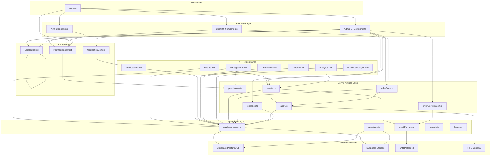
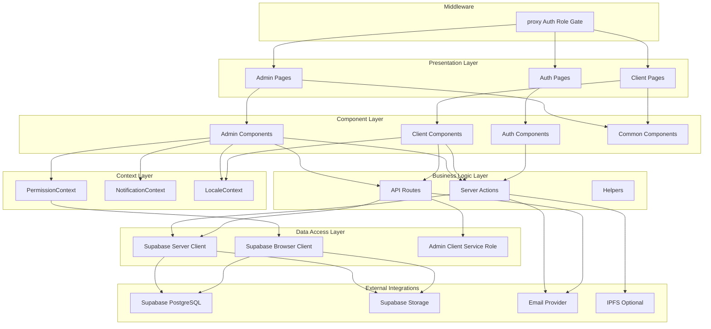
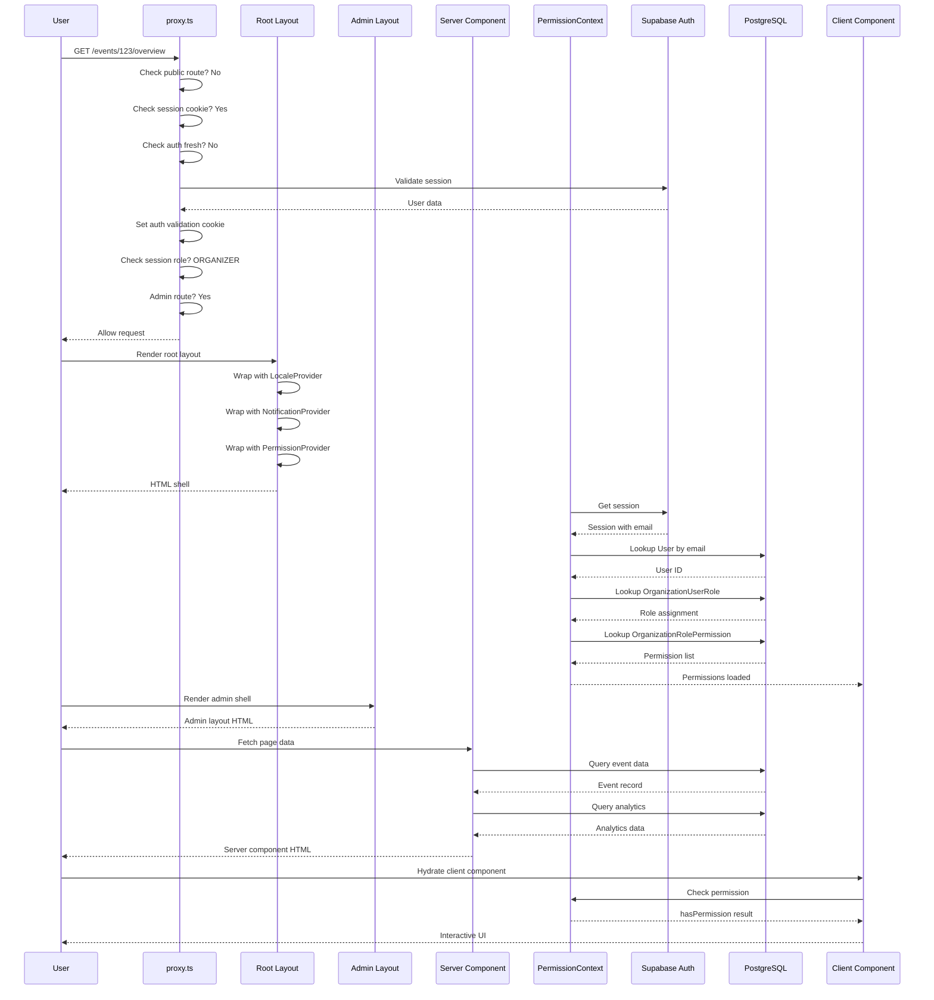
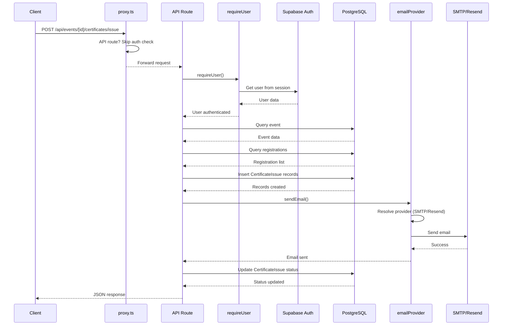
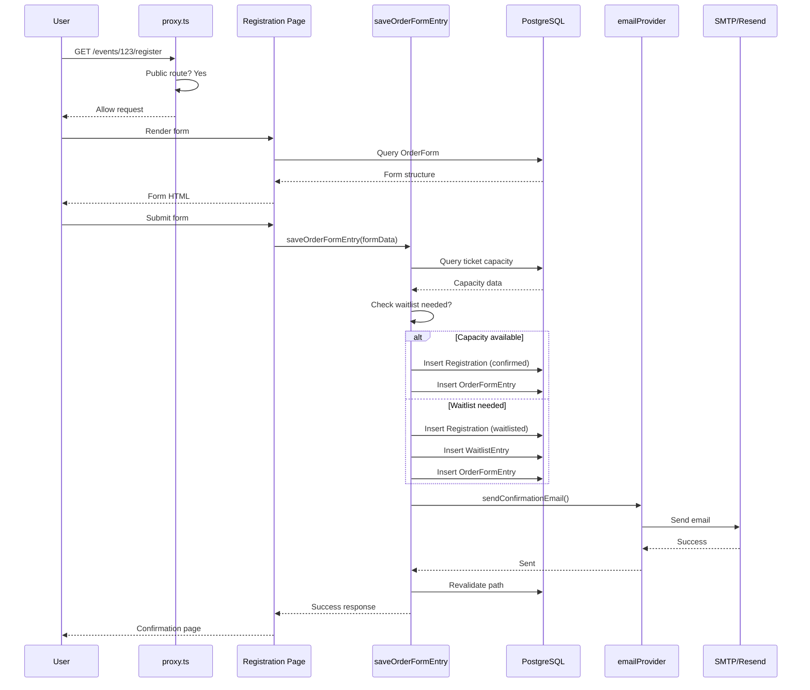
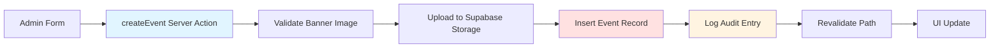
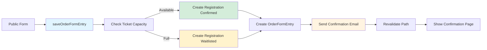
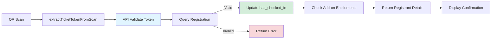

# G-Events Architecture Analysis

**Document Version:** 1.0  
**Analysis Date:** April 27, 2026  
**Project Version:** 0.9.4

---

## Table of Contents

1. [Executive Summary](#executive-summary)
2. [Module Analysis](#module-analysis)
3. [Global Architecture Overview](#global-architecture-overview)
4. [Request/Response Lifecycle](#requestresponse-lifecycle)
5. [Implicit Coupling Points](#implicit-coupling-points)
6. [Data Flow Diagrams](#data-flow-diagrams)
7. [Configuration & Environment Variables](#configuration--environment-variables)

---

## Executive Summary

G-Events is a Next.js-based event management platform using a feature-oriented layered architecture. The system is built around:

- **Frontend:** Next.js App Router with React 19, TypeScript, and Tailwind CSS v4
- **Backend:** Supabase (PostgreSQL + Row-Level Security) for data/auth/storage
- **Architecture Style:** Feature-oriented with clear separation between server actions, API routes, and UI components
- **Key Patterns:** Server Actions for mutations, API Routes for external integrations, React Context for global state

The application is divided into two main user experiences:
- **Admin Side** (`app/(admin_side)`): Event organizers and team management
- **Client Side** (`app/(client_side)`): Public event discovery and attendee registration

---

## Module Analysis

### 1. Authentication & Authorization Module

#### Purpose and Responsibility
- **Authentication:** Supabase Auth integration for user login/logout/session management
- **Authorization:** Role-based access control (RBAC) with 25 granular permissions across 7 categories
- **Session Management:** Dual-role session support (Organizer vs Attendee) with cookie-based role selection

#### Public Interfaces

**Server Actions:**
```typescript
// lib/actions/permissions.ts
getCurrentUserPermissions(email: string): Promise<UserPermissions>
```

**API Routes:**
```
POST /api/auth/register/validate
GET  /api/management/permissions
GET  /api/management/roles
POST /api/management/roles
GET  /api/management/roles/[id]
PATCH /api/management/roles/[id]
DELETE /api/management/roles/[id]
GET  /api/management/users
POST /api/management/users
PATCH /api/management/users/[id]
DELETE /api/management/users/[id]
```

**Context Hooks:**
```typescript
// contexts/PermissionContext.tsx
usePermissions(): {
  role: string
  roleId: number
  permissions: string[]
  isAdmin: boolean
  loading: boolean
  hasPermission(name: string): boolean
}
```

#### Internal Structure

**Key Files:**
- `lib/actions/permissions.ts` - Server action for permission resolution
- `lib/auth/sessionRole.ts` - Session role and organization context resolution
- `lib/apiAuth.ts` - API authentication helpers
- `contexts/PermissionContext.tsx` - Client-side permission provider
- `lib/db.ts` - User/Role/Permission CRUD operations

**Data Flow:**
1. User authenticates via Supabase Auth → session cookie set
2. User selects role (Organizer/Attendee) → `SESSION_ROLE_COOKIE_NAME` cookie set
3. `PermissionContext` fetches permissions via `getCurrentUserPermissions(email)`
4. Permission lookup: User → OrganizationUserRole → OrganizationRole → OrganizationRolePermission → OrganizationPermission
5. UI components use `hasPermission(name)` to gate features

#### Dependencies

**Calls:**
- Supabase Auth (`@supabase/ssr`, `@supabase/supabase-js`)
- Database tables: `User`, `Organization`, `OrganizationRole`, `OrganizationPermission`, `OrganizationRolePermission`, `OrganizationUserRole`

**Called By:**
- All admin-side pages via `PermissionProvider`
- API routes via `requireUser()` middleware
- `proxy.ts` for route-level role gating

#### Configuration Points

**Environment Variables:**
- `NEXT_PUBLIC_SUPABASE_URL` - Supabase project URL
- `NEXT_PUBLIC_SUPABASE_ANON_KEY` - Supabase anon key
- `SUPABASE_SERVICE_ROLE_KEY` - Service role key for admin operations (optional)
- `NEXT_PUBLIC_DEFAULT_ORG_ID` - Default organization ID (default: 1)

**Cookies:**
- `SESSION_ROLE_COOKIE_NAME` = "g_events_session_role" - User's selected role
- `ACTIVE_ORGANIZATION_COOKIE_NAME` = "g_events_active_organization_id" - Active organization
- `g_events_auth_validated_at` - Auth validation cache (5min TTL)

---

### 2. Event Management Module

#### Purpose and Responsibility
- CRUD operations for events (create, read, update, delete)
- Event metadata management (title, description, dates, location, capacity)
- Banner image upload to Supabase Storage
- Agenda slot management
- Event publishing and visibility control
- Audit logging for all event mutations

#### Public Interfaces

**Server Actions:**
```typescript
// lib/actions/events.ts
createEvent(formData: FormData): Promise<CreateEventState>
getEvents(): Promise<Event[]>
getEventById(id: number): Promise<Event | null>
updateEvent(id: number, data: Partial<EventUpdateData>): Promise<{success, error}>
deleteEvent(id: number): Promise<{success, error}>
uploadEventBanner(formData: FormData): Promise<{success, url, error}>
saveAgendaSlot(event_id: number, slot: AgendaSlot): Promise<{success, error}>
deleteAgendaSlot(id: string): Promise<{success, error}>
getEventAnalytics(eventId: number): Promise<AnalyticsData>
getEventReports(eventId: number): Promise<EventReportsData>
getEventDemographics(eventId: number): Promise<DemographicsData>
getGeneralAnalytics(): Promise<GeneralAnalyticsData>
```

**API Routes:**
```
GET    /api/events
POST   /api/events
GET    /api/events/[eventId]
PATCH  /api/events/[eventId]
DELETE /api/events/[eventId]
GET    /api/analytics/event/[eventId]
GET    /api/analytics/events
GET    /api/analytics/general
```

#### Internal Structure

**Key Files:**
- `lib/actions/events.ts` - Main server actions (2673 lines, high churn)
- `lib/db.ts` - Event CRUD with audit logging
- `lib/actions/audit.ts` - Audit trail logging
- `lib/uploadedImageValidation.ts` - Banner image validation
- `lib/slug.ts` - Event slug generation

**Data Flow:**
1. Admin submits event form → `createEvent(formData)` server action
2. Form data includes banner file → validated and uploaded to Supabase Storage
3. Event record inserted into `Event` table with organization_id
4. Audit entry logged to `AuditLog` table
5. Path revalidated via `revalidatePath()`
6. UI updates with new event data

**Ticket Window Adjustment Logic:**
- When event end date is moved earlier, ticket selling windows are automatically adjusted
- 5-day buffer maintained between ticket end and event end
- Prevents tickets from being sold after event ends

#### Dependencies

**Calls:**
- Supabase client (`lib/supabase-server.ts`)
- Supabase Storage (banner images)
- Database tables: `Event`, `AgendaSlot`, `AuditLog`
- Email provider (for confirmation emails)
- Audit logging module

**Called By:**
- Admin event pages (`app/(admin_side)/events/`)
- Dashboard (`app/(admin_side)/dashboard/`)
- Analytics pages (`app/(admin_side)/analytics/`)
- Public event pages (`app/(client_side)/events/`)

#### Configuration Points

**Environment Variables:**
- `NEXT_PUBLIC_SUPABASE_URL` - For storage access
- `NEXT_PUBLIC_SUPABASE_ANON_KEY` - For storage access
- `SUPABASE_SERVICE_ROLE_KEY` - For storage uploads (optional)

**Constants:**
- `MAX_EVENT_BANNER_SIZE_BYTES` = 20MB
- `ALLOWED_EVENT_BANNER_MIME_TYPES` = JPEG, PNG, WebP, GIF, AVIF, SVG
- `EVENT_RESCHEDULE_TICKET_BUFFER_DAYS` = 5

---

### 3. Registration & Order Management Module

#### Purpose and Responsibility
- Attendee registration flow with order form submission
- Ticket selection and capacity management
- Waitlist handling when tickets are full
- Order form data collection (10 input types)
- Registration confirmation emails
- Check-in status tracking

#### Public Interfaces

**Server Actions:**
```typescript
// lib/actions/orderForm.ts
saveOrderForm(eventId, title, description, formData, formId?): Promise<SaveOrderFormState>
getOrderFormById(formId: number): Promise<OrderForm>
saveOrderFormEntry(eventId, orderFormId, formData, userEmail?, registrationId?): Promise<SaveOrderFormEntryState>
getOrderFormEntriesByEvent(eventId: number): Promise<OrderFormEntry[]>
getOrderFormEntriesByForm(orderFormId: number): Promise<OrderFormEntry[]>
getOrderFormEntry(entryId: number): Promise<OrderFormEntry>
deleteOrderFormEntry(entryId: number, eventId: number): Promise<{success, error}>
generateOrderFormEntriesCSV(orderFormId: number): Promise<{success, csv, error}>
```

**API Routes:**
```
GET    /api/events/[eventId]/orders
POST   /api/events/[eventId]/orders
GET    /api/events/[eventId]/orders/[registrationId]
PATCH  /api/events/[eventId]/orders/[registrationId]
GET    /api/events/[eventId]/waitlist
```

#### Internal Structure

**Key Files:**
- `lib/actions/orderForm.ts` - Order form configuration and entry management
- `lib/actions/orders.ts` - Registration and order logic
- `lib/hooks/useOrderFormSubmit.ts` - Client-side form submission hook
- `lib/registrationPaymentFields.ts` - Payment field handling (unused in thesis)

**Data Flow:**
1. Public user accesses `/events/[eventId]/register`
2. Order form rendered from `OrderForm` table
3. User submits form → `saveOrderFormEntry()` server action
4. Form data stored as JSONB in `OrderFormEntries.form_data`
5. Registration created in `Registration` table
6. Waitlist decision based on ticket capacity
7. Confirmation email sent via `sendEmail()`

**Order Form Input Types:**
- `short_answer` - Single line text
- `paragraph` - Multi-line textarea
- `multiple_choice` - Radio buttons
- `checkboxes` - Multi-select checkboxes
- `dropdown` - Select dropdown
- `file_upload` - File upload with drag-drop
- `multiple_choice_grid` - Grid with radio buttons
- `checkbox_grid` - Grid with checkboxes
- `date` - Date picker
- `time` - Time picker

**Field Identifiers:**
- Personal: `first_name`, `last_name`, `email`, `phone`
- Demographics: `gender`, `age`, `date_of_birth`
- Address: `address`, `city`, `state`, `country`, `zip_code`
- Professional: `company`, `job_title`, `department`
- Special: `dietary_restrictions`, `special_needs`, `agree_to_terms`, `newsletter_signup`
- Custom: `custom` for non-standard fields

#### Dependencies

**Calls:**
- Supabase client
- Database tables: `OrderForm`, `OrderFormEntries`, `Registration`, `Ticket`, `WaitlistEntry`
- Email provider
- Audit logging

**Called By:**
- Public registration page (`app/(client_side)/events/[eventId]/register`)
- Admin order form builder (`components/admin/OrderForm.tsx`)
- Admin order management pages

#### Configuration Points

**Environment Variables:**
- `EMAIL_PROVIDER` - SMTP or Resend
- `SMTP_*` variables for SMTP configuration
- `RESEND_API_KEY`, `RESEND_FROM_EMAIL` for Resend

---

### 4. Check-In Module

#### Purpose and Responsibility
- Real-time attendee check-in via QR code scanning
- Manual check-in by registration ID
- Check-in status tracking in database
- Add-on redemption tracking
- Breakout session check-in

#### Public Interfaces

**API Routes:**
```
GET    /api/events/[eventId]/checkin
PATCH  /api/events/[eventId]/checkin/[registrationId]
POST   /api/events/[eventId]/checkin/scan
POST   /api/events/[eventId]/checkin/scan/apply
GET    /api/events/[eventId]/checkin/breakout-roster
POST   /api/events/[eventId]/checkin/[registrationId]/claim-addon
```

#### Internal Structure

**Key Files:**
- `lib/checkinScan.ts` - QR code token extraction
- `lib/checkinQr.ts` - QR code generation for e-tickets
- `lib/breakoutCheckinScan.ts` - Breakout session scanning
- `lib/checkinAddOnClaims.ts` - Add-on redemption logic
- `components/admin/checkin/` - Check-in UI components

**Data Flow:**
1. Admin opens check-in page for event
2. Camera scans QR code or manual token entry
3. `extractTicketTokenFromScan()` normalizes input
4. API validates token against `Registration.ticket_token`
5. If valid, updates `Registration.has_checked_in = true`
6. Response includes registrant details for confirmation
7. Add-on claims tracked in `AddOnRedemption` table

**Token Format:**
- 16+ character alphanumeric string
- Stored in `Registration.ticket_token`
- Embedded in e-ticket QR codes
- Can be full URL with `?token=` parameter

#### Dependencies

**Calls:**
- Database tables: `Registration`, `Ticket`, `AddOnRedemption`, `AttendeeEntitlement`, `BreakoutSessionRegistration`
- QR code libraries (`qrcode`, `jsqr`, `html5-qrcode`)

**Called By:**
- Admin check-in page (`app/(admin_side)/events/[eventId]/checkin`)
- Mobile check-in interface

#### Configuration Points

**Environment Variables:**
- `TICKET_QR_EMAIL_SECRET` - HMAC secret for QR URL signing (optional, falls back to `CRON_SECRET`)
- `CRON_SECRET` - Fallback for QR URL signing

---

### 5. Certificate Module

#### Purpose and Responsibility
- Certificate template creation with custom positioning
- Certificate generation using jsPDF
- Certificate issuance queue management
- Email delivery of certificates
- Blockchain-style hash chain verification
- Public certificate verification API

#### Public Interfaces

**API Routes:**
```
GET    /api/certificates/[token]/verify
GET    /api/certificates/[token]/download
GET    /api/certificates/[token]/meta
POST   /api/events/[eventId]/certificates/templates
GET    /api/events/[eventId]/certificates/templates
PATCH  /api/events/[eventId]/certificates/templates/[templateId]
DELETE /api/events/[eventId]/certificates/templates/[templateId]
POST   /api/events/[eventId]/certificates/issue
POST   /api/events/[eventId]/certificates/process
GET    /api/events/[eventId]/certificates/recipients
```

**Cron Endpoints:**
```
POST /api/cron/process-certificate-emails
```

#### Internal Structure

**Key Files:**
- `lib/certificates.ts` - Certificate generation and email logic
- `lib/certificateLayout.ts` - Canvas layout constants
- `lib/certificateImageValidation.ts` - Background image validation
- `database/add_certificate_blockchain_ledger.sql` - Blockchain ledger schema

**Data Flow:**
1. Admin creates certificate template with background image and text positioning
2. Admin issues certificates to registrants → creates `CertificateIssue` records with status 'queued'
3. Cron job processes queue → generates PDF, stores in Supabase Storage
4. Email sent with download link containing access token
5. Hash chain entry created in `CertificateLedger` for verification
6. Public verification via `/api/certificates/[token]/verify`

**Blockchain Verification:**
- Application-level hash chain in PostgreSQL
- Each certificate has `certificate_hash` (SHA256 of certificate data)
- Each block has `block_hash` (SHA256 of certificate_hash + previous_hash)
- Verification API returns: `verified`, `certificateHash`, `blockHash`, `previousHash`, `blockIndex`, `blockTimestamp`

#### Dependencies

**Calls:**
- jsPDF for PDF generation
- Supabase Storage for certificate file storage
- Database tables: `CertificateTemplate`, `CertificateIssue`, `CertificateLedger`, `Registration`
- Email provider
- Crypto module for hashing

**Called By:**
- Admin certificate pages (`app/(admin_side)/events/[eventId]/certificates/`)
- Cron job for email processing
- Public verification endpoint

#### Configuration Points

**Environment Variables:**
- `APP_URL` - Required for secure absolute download links in production
- `CRON_SECRET` - Required for cron endpoint protection

---

### 6. Email Campaigns Module

#### Purpose and Responsibility
- Targeted email campaigns to event attendees
- Audience filtering by ticket type, status, attendance
- Campaign scheduling and queue management
- HTML email composition with image upload
- Campaign processing via cron job

#### Public Interfaces

**API Routes:**
```
GET    /api/events/[eventId]/email-attendees
POST   /api/events/[eventId]/email-attendees
GET    /api/events/[eventId]/email-attendees/[campaignId]
POST   /api/events/[eventId]/email-attendees/process
POST   /api/events/[eventId]/email-attendees/images
```

**Cron Endpoints:**
```
POST /api/cron/process-email-campaigns
```

#### Internal Structure

**Key Files:**
- `lib/emailCampaigns.ts` - Audience resolution and campaign logic
- `lib/emailProvider.ts` - Email sending abstraction (SMTP/Resend)
- `components/admin/` - Email campaign UI components

**Data Flow:**
1. Admin creates campaign with subject, body, and audience filters
2. Audience resolved via `resolveEventRecipients()` with filters:
   - Ticket types (specific IDs, general admission, premium)
   - Statuses (pending, confirmed, attended, not attended, waitlisted)
   - Attendance types (main event, breakout sessions)
3. Campaign stored in `EmailCampaign` table with status 'queued'
4. Cron job processes queue → sends emails via `sendEmail()`
5. Status updated to 'sent' or 'failed' with error message

**Audience Resolution Logic:**
- Joins `Registration` with `Ticket` for ticket type filtering
- Filters by `Registration.status` for status filtering
- Joins with `BreakoutSessionRegistration` for breakout attendance
- Returns list of `{ email, registrationId }` for sending

#### Dependencies

**Calls:**
- Email provider (`lib/emailProvider.ts`)
- Database tables: `EmailCampaign`, `Registration`, `Ticket`, `BreakoutSessionRegistration`
- Supabase Storage for campaign images

**Called By:**
- Admin email campaign pages (`app/(admin_side)/events/[eventId]/email-attendees/`)
- Cron job for processing

#### Configuration Points

**Environment Variables:**
- `EMAIL_PROVIDER` - "auto", "smtp", or "resend"
- `SMTP_HOST`, `SMTP_PORT`, `SMTP_SECURE`, `SMTP_USER`, `SMTP_PASS`, `SMTP_FROM_EMAIL`
- `SMTP_URL` - Alternative SMTP connection string
- `RESEND_API_KEY`, `RESEND_FROM_EMAIL`
- `CRON_SECRET` - Required for cron endpoint protection

---

### 7. Analytics & Reports Module

#### Purpose and Responsibility
- General analytics across all events (registrations, revenue, trends)
- Per-event analytics (registrations, attendance, demographics)
- Event reports with export (CSV, XLSX, PDF)
- Demographics visualization from order form data
- Top performing events tracking

#### Public Interfaces

**Server Actions:**
```typescript
// lib/actions/events.ts
getGeneralAnalytics(): Promise<GeneralAnalyticsData>
getEventAnalytics(eventId: number): Promise<EventAnalyticsData>
getEventReports(eventId: number): Promise<EventReportsData>
getEventDemographics(eventId: number): Promise<DemographicsData>
```

**API Routes:**
```
GET /api/analytics/general
GET /api/analytics/event/[eventId]
GET /api/analytics/events
```

#### Internal Structure

**Key Files:**
- `lib/actions/events.ts` - Analytics server actions
- `lib/exportUtils.ts` - Export utilities (CSV, XLSX, PDF)
- `components/admin/DashboardTabs.tsx` - Analytics visualization
- `components/admin/RegistrationChart.tsx` - Chart components

**Data Flow:**
1. Server component calls analytics server action
2. Queries aggregate data from multiple tables:
   - `Event` for event counts
   - `Registration` for registrations, revenue, attendance
   - `FeedbackForm` + `FeedbackAnswer` for satisfaction scores
   - `OrderFormEntries` for demographics
3. Data transformed into chart-ready format
4. Client components render visualizations
5. Export functions generate CSV/XLSX/PDF on demand

**Demographics Extraction:**
- Parses `OrderFormEntries.form_data` JSONB
- Extracts tracked field identifiers: `gender`, `age`, `city`, `country`, `state`, `company`, `job_title`, `department`, `dietary_restrictions`, `special_needs`, `newsletter_signup`
- Aggregates answer counts per field
- Returns distribution for visualization

**Chart Types:**
- Donut chart for age (grouped into ranges) and low-cardinality fields
- Horizontal bar chart for high-cardinality fields
- Line chart for monthly registration trends

#### Dependencies

**Calls:**
- Database tables: `Event`, `Registration`, `Ticket`, `FeedbackForm`, `FeedbackAnswer`, `OrderFormEntries`
- Export libraries: `exceljs`, `jspdf`, `jspdf-autotable`
- Chart libraries: Custom components (no external chart library)

**Called By:**
- Analytics pages (`app/(admin_side)/analytics/`)
- Event reports pages (`app/(admin_side)/events/[eventId]/reports/`)
- Dashboard (`app/(admin_side)/dashboard/`)

#### Configuration Points

**Environment Variables:**
- None specific to analytics

---

### 8. Breakout Sessions Module

#### Purpose and Responsibility
- Breakout session creation and management
- Session registration by attendees
- Session capacity management
- Session check-in tracking
- Ticket token integration for session access

#### Public Interfaces

**API Routes:**
```
GET    /api/events/[eventId]/breakouts
POST   /api/events/[eventId]/breakouts
GET    /api/events/[eventId]/breakouts/[sessionId]
PATCH  /api/events/[eventId]/breakouts/[sessionId]
DELETE /api/events/[eventId]/breakouts/[sessionId]
GET    /api/events/[eventId]/breakouts/attendee
POST   /api/events/[eventId]/breakouts/backfill-ticket-tokens
```

#### Internal Structure

**Key Files:**
- `lib/breakoutSessionUtils.ts` - Breakout session utilities
- `lib/breakoutCheckinScan.ts` - Breakout session scanning
- `components/public/BreakoutSessionPicker.tsx` - Session selection UI

**Data Flow:**
1. Admin creates breakout sessions with capacity limits
2. Attendees register for sessions via picker
3. Registration stored in `BreakoutSessionRegistration`
4. Check-in updates `check_in_time` timestamp
5. Ticket tokens used for session access control

#### Dependencies

**Calls:**
- Database tables: `BreakoutSession`, `BreakoutSessionRegistration`, `Registration`
- Check-in module for scanning

**Called By:**
- Admin breakout session pages
- Public session picker
- Check-in module

#### Configuration Points

**Environment Variables:**
- None specific to breakout sessions

---

### 9. Notifications Module

#### Purpose and Responsibility
- Real-time admin notifications from database state
- Notification polling every 30 seconds
- LocalStorage persistence for dismissed/read state
- Notification preferences (email, push, updates)
- Notification filtering by type

#### Public Interfaces

**API Routes:**
```
GET /api/notifications
```

**Context Hooks:**
```typescript
// contexts/NotificationContext.tsx
useNotifications(): {
  notifications: Notification[]
  unreadCount: number
  preferences: NotificationPreferences
  addNotification(notification)
  dismissNotification(id)
  markAsRead(id)
  markAllAsRead()
  clearAllNotifications()
}
```

#### Internal Structure

**Key Files:**
- `contexts/NotificationContext.tsx` - Notification provider
- `app/api/notifications/route.ts` - Notification generation endpoint
- `components/admin/NotificationDropdown.tsx` - Notification UI

**Data Flow:**
1. `NotificationProvider` mounted in root layout
2. On admin routes, starts polling `/api/notifications` every 30s
3. API generates notifications from live DB state:
   - `regs-today`: Registrations created today
   - `pending-orders`: Orders with status 'pending'
   - `event-soon-{id}`: Events starting within 24h
   - `waitlist`: Pending waitlist entries
4. Dismissed IDs filtered from localStorage
5. UI displays filtered notifications
6. Preferences control which notifications are shown

**Notification Types:**
- `info` - General information
- `success` - Successful operations
- `warning` - Action required
- `alert` - Critical issues

#### Dependencies

**Calls:**
- Database tables: `Registration`, `Event`, `WaitlistEntry`
- Supabase Auth for session detection
- LocalStorage for persistence

**Called By:**
- Admin header (`components/admin/Header.tsx`)
- All admin-side pages via provider

#### Configuration Points

**Environment Variables:**
- None specific to notifications

**LocalStorage Keys:**
- `g_events_dismissed_notifications` - Dismissed notification IDs
- `g_events_read_notifications` - Read notification IDs
- `g_events_notification_prefs` - User preferences

---

### 10. Internationalization (i18n) Module

#### Purpose and Responsibility
- Multi-language support for admin interface
- Static translation cache for common phrases
- DOM text node translation via MutationObserver
- Language/region preference persistence
- Server-side locale sync

#### Public Interfaces

**API Routes:**
```
GET  /api/user/locale
POST /api/user/locale
```

**Context Hooks:**
```typescript
// contexts/LocaleContext.tsx
useLocale(): {
  locale: LocaleSettings
  isLoadingLocale: boolean
  availableLanguages: TranslationLanguage[]
  saveLocale(next: {language, region}): Promise<boolean>
  t(text: string): string
}
```

#### Internal Structure

**Key Files:**
- `contexts/LocaleContext.tsx` - Locale provider
- `lib/i18n.ts` - Locale utilities and language catalog
- `lib/staticTranslations/` - Static translation files (ar.ts, de.ts, es.ts, fr.ts, etc.)

**Data Flow:**
1. On mount, loads locale from localStorage or server
2. Server sync via `/api/user/locale` (10min TTL)
3. When language changes, applies DOM translations:
   - Walks DOM tree with TreeWalker
   - Extracts text nodes (excluding scripts, styles, editable elements)
   - Looks up static translations
   - Replaces text node values
   - Uses MutationObserver for dynamic content
4. Translations cached per language to avoid repeated lookups

**Supported Languages:**
- English (en), Chinese (zh), Spanish (es), French (fr), German (de), Japanese (ja), Korean (ko), Portuguese (pt), Hindi (hi), Arabic (ar)

#### Dependencies

**Calls:**
- Static translation files
- DOM API for text manipulation
- `/api/user/locale` for server sync

**Called By:**
- All admin-side pages via provider
- User settings page

#### Configuration Points

**Environment Variables:**
- None specific to i18n

**LocalStorage Keys:**
- `g_events_locale_settings` - User's locale preference
- `g_events_locale_last_sync_at` - Server sync timestamp

---

### 11. Audit Trail Module

#### Purpose and Responsibility
- Tamper-evident audit logging for sensitive operations
- Hash-based chain for data integrity verification
- Before/after state capture for mutations
- Optional IPFS anchoring for external verification
- Audit log viewer in admin UI

#### Public Interfaces

**API Routes:**
```
GET /api/audit?entityType=Event&entityId=123
```

**Server Actions:**
```typescript
// lib/actions/audit.ts
logAuditEntry(entityType, entityId, action, payload, ipfsCid?): Promise<void>
getAuditEntries(entityType, entityId): Promise<AuditLog[]>
computeAuditHash(payload): string
```

#### Internal Structure

**Key Files:**
- `lib/actions/audit.ts` - Audit logging logic
- `database/add_audit_log_table.sql` - Audit log schema
- `components/admin/AuditLogViewer.tsx` - Audit log UI

**Data Flow:**
1. Before mutation, capture current state
2. Perform mutation
3. After mutation, capture new state
4. Compute SHA256 hash of normalized payload
5. Insert into `AuditLog` with:
   - `entity_type`, `entity_id`, `action`
   - `payload` (JSONB with before/after)
   - `audit_hash` (SHA256 of payload)
   - `prev_hash` (previous row's block_hash for chain)
   - `ipfs_cid` (optional)
6. UI displays audit history with hash chain

**Hash Chain Integrity:**
- Each row has `audit_hash` (content hash) and `block_hash` (chain hash)
- `block_hash = SHA256(audit_hash + prev_hash)`
- Tampering breaks the chain verification

#### Dependencies

**Calls:**
- Database table: `AuditLog`
- Crypto module for SHA256 hashing
- IPFS (optional, for external anchoring)

**Called By:**
- `lib/db.ts` for Event/Ticket/AddOn/Promotion mutations
- `lib/actions/orderForm.ts` for OrderFormEntry mutations
- Admin event overview page

#### Configuration Points

**Environment Variables:**
- None specific to audit trail

---

### 12. Proxy / Middleware Module

#### Purpose and Responsibility
- Route-level authentication and authorization
- Session role enforcement (Organizer vs Attendee)
- Legacy route redirects
- Auth validation caching
- Public route detection

#### Public Interfaces

**Middleware Function:**
```typescript
// proxy.ts
export async function proxy(request: NextRequest): Promise<NextResponse>
```

#### Internal Structure

**Key Files:**
- `proxy.ts` - Custom middleware (253 lines)

**Data Flow:**
1. Request enters middleware
2. Check for public routes (login, register, forgot-password, auth/callback)
3. Check for legacy admin routes → redirect to new paths
4. Check for waitlist invite registration → allow through
5. For protected routes:
   - Check for Supabase session cookie
   - If missing, redirect to login
   - If present but not fresh (5min TTL), validate with Supabase
   - Set auth validation cookie
6. Check session role cookie:
   - Admin routes require ORGANIZER role
   - Attendee routes require ATTENDEE role
   - If wrong role, redirect to appropriate dashboard
   - If no role, redirect to role selection
7. Allow request to proceed

**Route Classification:**
- **Public:** `/login`, `/register`, `/forgot-password`, `/auth/*`
- **Admin:** `/dashboard`, `/events/*`, `/management/*`, `/profile`, `/settings`, `/analytics/*`
- **Attendee:** `/home`, `/tickets`, `/events/[eventId]/register`, `/events/[eventId]/review`, `/events/[eventId]/my-breakouts`

**Legacy Redirects:**
- `/admin/dashboard` → `/dashboard`
- `/admin/management` → `/management`
- `/admin/profile` → `/profile`
- `/admin/settings` → `/settings`
- `/admin/analytics` → `/analytics/all`

#### Dependencies

**Calls:**
- Supabase Auth (`@supabase/ssr`)
- Cookie API for session/role cookies
- Next.js routing for redirects

**Called By:**
- Next.js middleware system (configured in `proxy.ts` export config)

#### Configuration Points

**Environment Variables:**
- `NEXT_PUBLIC_SUPABASE_URL` - For auth validation
- `NEXT_PUBLIC_SUPABASE_ANON_KEY` - For auth validation

**Cookies:**
- `g_events_auth_validated_at` - Auth validation timestamp (5min TTL)
- `g_events_session_role` - User's selected role

---

## Global Architecture Overview

### Module Dependency Graph



### High-Level Architecture Layers



---

## Request/Response Lifecycle

### Admin Page Request Flow



### API Route Request Flow



### Public Registration Flow



---

## Implicit Coupling Points

### 1. Shared Database Schema

**Coupling:** All modules share the same PostgreSQL database via Supabase. Schema changes affect multiple modules simultaneously.

**Impact:**
- Adding columns to `Event` table affects event management, analytics, certificates, and email campaigns
- Changing `Registration` status values affects check-in, reports, waitlist, and notifications
- RLS policy changes can break access across all modules

**Mitigation:**
- Database migrations are versioned in `database/` directory
- Combined migration script `add_combined_event_feature_tables.sql` for coordinated changes
- Audit logging tracks schema-affecting mutations

### 2. Supabase Session Cookie

**Coupling:** Authentication state is shared across admin and client sides via Supabase session cookies.

**Impact:**
- Logging out on admin side also logs out from client side
- Session expiration affects both user experiences simultaneously
- Cookie-based auth validation caching (5min TTL) affects all protected routes

**Mitigation:**
- Session role cookie (`g_events_session_role`) allows dual-role experience
- Auth validation cookie (`g_events_auth_validated_at`) reduces Supabase calls
- Clear separation of admin vs attendee routes in `proxy.ts`

### 3. Organization Context

**Coupling:** All admin operations are scoped to an active organization, stored in cookie and resolved via `getCurrentUserActiveOrganization()`.

**Impact:**
- Switching organizations affects all admin pages
- Organization scoping is enforced in multiple places (server actions, API routes, DB queries)
- Missing organization context causes failures across admin module

**Mitigation:**
- Centralized organization resolution in `lib/auth/sessionRole.ts`
- Cookie-based persistence (`g_events_active_organization_id`)
- Fallback to `DEFAULT_ORG_ID` from environment

### 4. Email Provider Configuration

**Coupling:** Email sending is abstracted but configuration is global. All email operations (confirmations, campaigns, certificates) use the same provider.

**Impact:**
- SMTP misconfiguration breaks all email flows
- Provider selection (auto/smtp/resend) affects entire system
- Email HTML URL normalization uses global `APP_URL`

**Mitigation:**
- Provider auto-selection with fallback logic
- Per-provider environment variables
- `APP_URL` validation in production

### 5. File Storage Configuration

**Coupling:** Supabase Storage is used for event banners, certificate backgrounds, and campaign images. Configuration is shared.

**Impact:**
- Storage bucket permissions affect multiple features
- Remote image patterns in `next.config.ts` must include all storage URLs
- Storage client creation uses service role key when available

**Mitigation:**
- Separate buckets for different asset types (events, certificates)
- Service role fallback for upload operations
- Remote pattern configuration in Next.js

### 6. Permission System

**Coupling:** Permission checks are distributed across UI components, server actions, and API routes. Permission data is centralized but checks are decentralized.

**Impact:**
- Adding new permissions requires updates in multiple places
- Permission caching (server + client) can cause stale data
- Admin role bypass logic is duplicated

**Mitigation:**
- Centralized permission resolution in `getCurrentUserPermissions()`
- Permission cache with 2min TTL on both server and client
- Fail-open behavior for loading state

### 7. Audit Logging

**Coupling:** Audit logging is instrumented in `lib/db.ts` for specific entity types. Not all mutations are audited.

**Impact:**
- Adding new auditable entities requires modifying `lib/db.ts`
- Audit logging failures are silently caught (warning only)
- Audit log viewer only shows audited entities

**Mitigation:**
- Try-catch around audit logging to prevent blocking mutations
- Console warnings for audit failures
- Clear documentation of audited entities

### 8. Notification Generation

**Coupling:** Notifications are generated from live database state in the API route. Notification logic is tightly coupled to schema.

**Impact:**
- Schema changes can break notification queries
- New data sources require notification API updates
- Notification filtering logic is hardcoded

**Mitigation:**
- `Promise.allSettled` for parallel queries (one failure doesn't break all)
- Silent failure handling with console warnings
- Notification preferences for filtering

### 9. Translation System

**Coupling:** DOM-based translation system walks the entire document tree. Performance and correctness depend on DOM structure.

**Impact:**
- Large DOM trees slow down translation
- Dynamic content requires MutationObserver
- Translation cache can become stale

**Mitigation:**
- Translation cache per language
- RequestAnimationFrame batching for DOM updates
- Static translation files for common phrases

### 10. Cron Endpoints

**Coupling:** Cron endpoints share the same `CRON_SECRET` for protection. Secret compromise affects all scheduled jobs.

**Impact:**
- Single secret for email campaigns and certificate emails
- No per-endpoint secrets
- Secret used for QR URL signing as fallback

**Mitigation:**
- Constant-time comparison via `safeCompareSecrets()`
- Separate `TICKET_QR_EMAIL_SECRET` for QR URLs
- Documented secret generation process

---

## Data Flow Diagrams

### Event Creation Data Flow



### Registration Flow



### Certificate Issuance Flow

```mermaid
graph LR
    A[Admin Issue Request] --> B[Create CertificateIssue Records]
    B --> C[Status: queued]
    C --> D[Cron Job Processing]
    D --> E[Generate PDF with jsPDF]
    E --> F[Upload to Supabase Storage]
    F --> G[Create CertificateLedger Entry]
    G --> H[Send Email with Download Link]
    H --> I[Status: sent]
    I --> J[Verification API Available]
    
    style D fill:#fff4e1
    style G fill:#e1f5ff
    style J fill:#d4edda
```



### Check-In Flow



---

## Configuration & Environment Variables

### Required Environment Variables

| Variable | Purpose | Used By |
|----------|---------|---------|
| `NEXT_PUBLIC_SUPABASE_URL` | Supabase project URL | All Supabase clients |
| `NEXT_PUBLIC_SUPABASE_ANON_KEY` | Supabase anon key | All Supabase clients |
| `NEXT_PUBLIC_DEFAULT_ORG_ID` | Default organization ID | Organization context resolution |
| `CRON_SECRET` | Cron endpoint protection | Cron routes, QR URL signing |
| `APP_URL` | Production app origin | Email URL normalization, certificate links |

### Optional Environment Variables

| Variable | Purpose | Default/Fallback |
|----------|---------|-----------------|
| `SUPABASE_SERVICE_ROLE_KEY` | Service role for admin operations | Falls back to anon key |
| `EMAIL_PROVIDER` | Email provider selection | "auto" (auto-detect) |
| `SMTP_HOST` | SMTP server hostname | Required if using SMTP |
| `SMTP_PORT` | SMTP port | 587 (inferred from secure flag) |
| `SMTP_SECURE` | Use TLS | Inferred from port (465=true) |
| `SMTP_USER` | SMTP username | Required if using SMTP |
| `SMTP_PASS` | SMTP password | Required if using SMTP |
| `SMTP_FROM_EMAIL` | SMTP from address | Required if using SMTP |
| `SMTP_URL` | Full SMTP connection URL | Alternative to host/user/pass |
| `RESEND_API_KEY` | Resend API key | Required if using Resend |
| `RESEND_FROM_EMAIL` | Resend from address | Required if using Resend |
| `TICKET_QR_EMAIL_SECRET` | QR URL HMAC secret | Falls back to `CRON_SECRET` |

### Cookie Configuration

| Cookie Name | Purpose | TTL |
|-------------|---------|-----|
| `g_events_session_role` | User's selected role (organizer/attendee) | Session |
| `g_events_active_organization_id` | Active organization ID | Session |
| `g_events_auth_validated_at` | Auth validation timestamp | 5 minutes |
| `g_events_dismissed_notifications` | Dismissed notification IDs | Persistent |
| `g_events_read_notifications` | Read notification IDs | Persistent |
| `g_events_notification_prefs` | Notification preferences | Persistent |
| `g_events_locale_settings` | User's locale preference | Persistent |
| `g_events_locale_last_sync_at` | Locale server sync timestamp | 10 minutes |

### Next.js Configuration

**next.config.ts:**
- Development tunnel support (ngrok, Cloudflare, trycloudflare)
- Remote image patterns for Supabase Storage
- Google auth avatar support

**tsconfig.json:**
- Path alias: `@/*` maps to repository root
- Target: ES2017
- Strict mode enabled
- JSX: react-jsx

---

## Conclusion

G-Events follows a clean, feature-oriented architecture with clear separation between:
- **Presentation:** React components organized by domain (admin, client, auth, common)
- **Business Logic:** Server actions for mutations, API routes for external integrations
- **Data Access:** Supabase client wrappers with server/browser separation
- **Cross-Cutting Concerns:** Context providers for permissions, notifications, locale

The system is well-structured for a capstone/thesis project with:
- Comprehensive RBAC system
- Audit trail with hash-based integrity
- Certificate verification using application-level blockchain
- Multi-language support
- Real-time notifications
- Email campaign management

Key architectural strengths:
- Clear module boundaries
- Centralized authentication and authorization
- Audit logging for sensitive operations
- Environment-based configuration
- Comprehensive API surface

Areas for future improvement:
- Split large server action files (`lib/actions/events.ts` at 2673 lines)
- Add end-to-end testing (currently only unit/integration)
- Implement container/runtime configuration
- Add rate limiting for high-cost API routes
- Consider event-driven architecture for notifications (currently polling)
