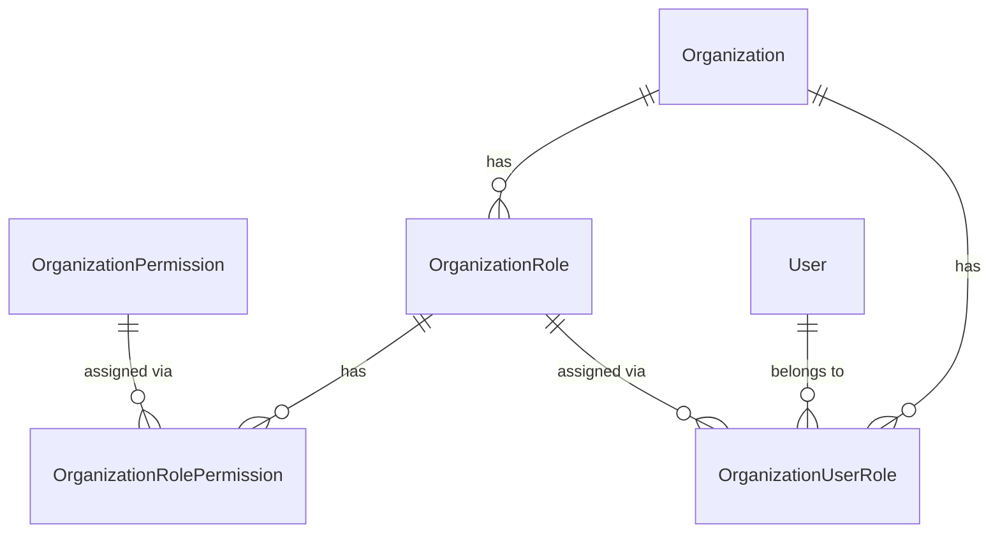
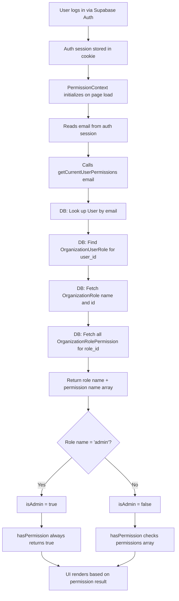

# G-Events — Management Side Documentation
## Roles, Permissions & User Management

---

## Overview

The G-Events management system controls **who can do what** inside the platform. Every user belongs to an **Organization** and is assigned one **Role**. That role carries a set of **Permissions** that gate specific features both in the UI and on the server.

Access to the `/management` module is restricted to **Admin** users only. Non-Admin users attempting to navigate there are redirected.

---

## Database Schema

Five tables power the entire roles-and-permissions system:

| Table | Purpose |
|---|---|
| `Organization` | The top-level container. All users, roles, and permissions belong to an org. |
| `OrganizationRole` | Roles that exist within an organization (e.g., Admin, Core Member). |
| `OrganizationPermission` | The master list of all available permissions (global, not per-org). |
| `OrganizationRolePermission` | Join table — which permissions are assigned to which role. |
| `OrganizationUserRole` | Join table — which user has which role inside which organization. |



---

## The Three Default Roles

Roles are seeded in `database/seed.sql` and scoped to a specific organization.

### 🔴 Admin
> Full system access — all permissions granted automatically.

The Admin role receives **every** permission in the system. Admins are also the only users who can access the `/management` page to manage other users and roles.

- `isAdmin` is set to `true` when the role name equals `"Admin"` (case-insensitive)
- Admins **bypass individual permission checks** — if `isAdmin` is true, `hasPermission()` always returns `true`

---

### 🟡 Core Member
> Full access to team operation features, with no system-administration capabilities.

| Permission | Category |
|---|---|
| Create Event | Event Creation |
| Edit Event Details | Event Creation |
| Manage Tickets | Event Creation |
| Add Attendee | Order Registration |
| Edit Attendee Details | Order Registration |
| View List of Attendees | Order Registration |
| Check In Attendees | Order Registration |
| View Reports | Reporting |

---

### 🟢 Volunteer
> Read-only access for on-the-day event operations.

| Permission | Category |
|---|---|
| View List of Attendees | Order Registration |
| Check In Attendees | Order Registration |

---

## All 25 Permissions (by Category)

Permissions are stored in `OrganizationPermission` and grouped by `category`.

### 🎟 Event Creation (`eventCreation`)
| Permission Name | Description |
|---|---|
| Create Event | Create new events in the system |
| Edit Event Details | Modify event title, description, dates, location, etc. |
| Manage Event Status | Publish or unpublish events |
| Manage Tickets | Create and configure ticket types |
| Manage Event Agenda | Add/edit agenda items for events |

### 📋 Order Registration (`orderRegistration`)
| Permission Name | Description |
|---|---|
| Add Attendee | Manually register a new attendee |
| Edit Attendee Details | Modify existing registrant information |
| Cancel Attendee Registration | Remove or cancel a registration |
| View List of Attendees | See the full attendee roster |
| Check In Attendees | Mark attendees as present at an event |
| Apply Discounts and Promo Codes | Apply promotional pricing |
| Manage Ticket Add-Ons | Handle add-on purchases |
| Send Emails | Trigger manual emails to attendees |

### 🧩 Breakout Session (`breakoutSession`)
| Permission Name | Description |
|---|---|
| Create Breakout Sessions | Add sub-sessions to an event |
| Edit Breakout Sessions | Modify existing breakout sessions |
| Manage Breakout Session Attendance | Track who attends which session |

### ⏳ Waitlist Management (`waitlistManagement`)
| Permission Name | Description |
|---|---|
| Manage Waitlist | Accept or reject waitlisted registrants |
| View Waitlist Queue | See who is waiting for a spot |

### 🎓 E-Certificate (`eCertificate`)
| Permission Name | Description |
|---|---|
| Manage Certificate Issuance | Trigger and manage e-certificate delivery |
| View E-Certificates | Browse issued certificates |

### 📊 Reporting (`reporting`)
| Permission Name | Description |
|---|---|
| View Reports | Access analytics and event reports |
| Export Order Report | Download order data as a file |

### 📧 Emails User Can Receive (`emailsUserCanReceive`)
| Permission Name | Description |
|---|---|
| New Registrant Email | Receive an email when a new person registers |
| Waitlist Email | Receive an email about waitlist changes |
| New Message or Inquiry From Attendee | Receive attendee messages/inquiries |

---

## Permission Resolution Flow

This is the end-to-end journey from a user logging in to a feature being shown or hidden.



### Fail-Open Behavior

The `hasPermission()` function is designed to be **fail-open** to protect admins in edge cases:

| State | Outcome |
|---|---|
| Still loading (initial page render) | Returns `true` — avoid flashing "Access Denied" |
| Load complete, role is empty (DB lookup failed) | Returns `true` — fail-safe for admins |
| Load complete, role found, `isAdmin = true` | Returns `true` — always allowed |
| Load complete, role found, `isAdmin = false` | Checks if the permission name is in the list |

---

## API Reference

All routes are under `/api/management/` and require an authenticated session (`requireUser()`). All responses follow `{ success: boolean, data?: ..., error?: string }`.

### Users

| Method | Endpoint | Description | Required Body |
|---|---|---|---|
| `GET` | `/api/management/users?organizationId=` | List all users in the org with their roles | — |
| `POST` | `/api/management/users` | Invite (add) a user to the org | `name`, `email`, `roleId` |
| `PATCH` | `/api/management/users/[id]` | Update a user's email or role | `email`, `roleId` |
| `DELETE` | `/api/management/users/[id]` | Remove a user from the organization | — |

> **Note:** Inviting a user checks for an existing `User` row by email (case-insensitive). If found, it reuses the existing record and only creates a new `OrganizationUserRole` assignment. Emails are always stored **lowercase**.

### Roles

| Method | Endpoint | Description | Required Body |
|---|---|---|---|
| `GET` | `/api/management/roles?organizationId=` | List all roles in the org | — |
| `POST` | `/api/management/roles` | Create a new role | `name`, `permissionIds[]` |
| `GET` | `/api/management/roles/[id]` | Get a role's assigned permission IDs | — |
| `PATCH` | `/api/management/roles/[id]` | Update a role's name, description, and permissions | `name`, `permissionIds[]` |
| `DELETE` | `/api/management/roles/[id]` | Delete a role (cascades role-permission links) | — |

> **Important:** When updating a role's permissions (`PATCH`), the API performs a **full replace**: it deletes all existing `OrganizationRolePermission` rows for that role and inserts the new set. Always send the complete list of desired permission IDs.

### Permissions

| Method | Endpoint | Description |
|---|---|---|
| `GET` | `/api/management/permissions` | List all available permissions (sorted by category, then name) |

---

## How the Management UI Works

The management page is at `/management` (`app/(admin_side)/management/page.tsx`). It has three main sections:

### 1. Members Tab
- Displays all organization users with their name, email, and current role
- **Add Member** → `POST /api/management/users`
- **Edit Member** → `PATCH /api/management/users/[id]`
- **Remove Member** → `DELETE /api/management/users/[id]`

### 2. Roles Tab
- Displays all roles with their description and permission count
- **Add Role** → `POST /api/management/roles`
- **Edit Role** → `PATCH /api/management/roles/[id]`
- **Delete Role** → `DELETE /api/management/roles/[id]`

### 3. Permissions Checklist (inside Edit/Create Role)
All 25 permissions are shown grouped by category with checkboxes. The selected checkboxes are mapped to their database IDs before being sent to the API.

---

## Developer Guide: Gating Features by Permission

Use the `usePermissions()` hook from `PermissionContext` anywhere in client components:

```tsx
import { usePermissions } from "@/contexts/PermissionContext";

export function MyComponent() {
    const { hasPermission, isAdmin, role, loading } = usePermissions();

    if (loading) return <Spinner />;

    return (
        <div>
            {hasPermission("Create Event") && <CreateEventButton />}
            {isAdmin && <ManagementLink />}
        </div>
    );
}
```

### Key values from `usePermissions()`

| Property | Type | Description |
|---|---|---|
| `role` | `string` | The user's role name (e.g., `"Admin"`) |
| `roleId` | `number` | The database ID of the role |
| `permissions` | `string[]` | Array of permission names the user holds |
| `isAdmin` | `boolean` | `true` if role name is `"admin"` |
| `loading` | `boolean` | `true` while permissions are being fetched |
| `hasPermission(name)` | `function` | Check if the user has a specific permission |

---

## Adding a New Permission (Developer Checklist)

1. **Add to database** — Insert a new row into `OrganizationPermission` with a `name` and `category`
2. **Assign to roles** — Update `OrganizationRolePermission` for the appropriate roles (or update `seed.sql` for fresh setups)
3. **Gate the feature** — Use `hasPermission("Your New Permission Name")` in the UI or API route
4. **Verify** — Use `database/verify_permissions.sql` to confirm the mapping is correct

---

## File Reference

| File | Purpose |
|---|---|
| `database/seed.sql` | Initial roles, permissions, and assignments |
| `contexts/PermissionContext.tsx` | Client-side permission hook |
| `lib/actions/permissions.ts` | Server action: resolve permissions from DB by email |
| `lib/db.ts` | Data layer: CRUD for users, roles, permissions |
| `app/api/management/users/route.ts` | REST API: list & invite users |
| `app/api/management/users/[id]/route.ts` | REST API: update & remove a user |
| `app/api/management/roles/route.ts` | REST API: list & create roles |
| `app/api/management/roles/[id]/route.ts` | REST API: get, update & delete a role |
| `app/api/management/permissions/route.ts` | REST API: list all permissions |
| `app/(admin_side)/management/page.tsx` | The management UI page |
